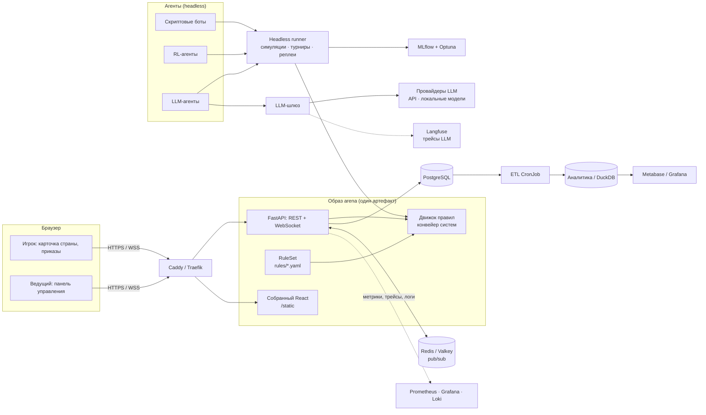

# «Мировая Арена» — роадмап веб-игры (трек 1)

Пошаговая многопользовательская стратегия на тему ООН по мотивам «Немодели ООН в Смольном».
Стек: **Python + FastAPI + PostgreSQL + React/TypeScript**, упаковка в контейнеры, запуск одной командой на любом ПК, Kubernetes там, где он даёт реальную пользу или реальный опыт.

Правила игры развиваются версиями (`GAME_RULES.md` → `GAME_RULES_2.md` → `GAME_RULES_3.md`) после реальных партий, поэтому проект с первого дня заточен под дешёвые изменения, тестирование и эксперименты, включая игру LLM-агентов.

Цели проекта, кроме сдачи задания: прокачать fullstack, DevOps/SRE, аналитику данных и ML на одном живом продукте.

---

## Содержание

1. [Принципы проекта](#1-принципы-проекта)
2. [Архитектура](#2-архитектура)
3. [Архитектура движка: всё под изменения](#3-архитектура-движка-всё-под-изменения)
4. [Элементы стека: что это и как работает](#4-элементы-стека-что-это-и-как-работает)
5. [«Бинарник без зависимостей» в мире Python](#5-бинарник-без-зависимостей-в-мире-python)
6. [Kubernetes: где оправдан, а где нет](#6-kubernetes-где-оправдан-а-где-нет)
7. [Запуск на любом ПК: три режима](#7-запуск-на-любом-пк-три-режима)
8. [Структура репозитория](#8-структура-репозитория)
9. [Стратегия тестирования](#9-стратегия-тестирования)
10. [Эволюция правил: трек версий](#10-эволюция-правил-трек-версий)
11. [Роадмап по этапам](#11-роадмап-по-этапам)
12. [Карта навыков](#12-карта-навыков)
13. [Типичные ловушки](#13-типичные-ловушки)
---

## 1. Принципы проекта

Главная идея: **игра будет меняться после каждой реальной партии**, поэтому вся архитектура заточена под дешёвые изменения правил, быстрые проверки и воспроизводимость.

1. **Движок правил — чистая функция поверх конвейера систем.** `resolve_round(state, orders, rules, seed) -> (new_state, events)`. Без базы, без HTTP. Каждая механика — отдельная система, которую можно добавить, убрать или переставить.
2. **Правила — это данные, а не код.** Цены, эффекты, лимиты, веса формул и список включённых модулей живут в версионированных YAML-файлах. Настройка баланса — это правка конфига, а не кода.
3. **Каждая игра закреплена за версией правил.** В базе хранится версия и снимок параметров, с которыми игра создана. Старые партии всегда можно переиграть и разобрать.
4. **Полный детерминизм.** Любая случайность идёт из зерна игры. Одинаковые правила + приказы + зерно = одинаковый результат. На этом держатся тесты, симуляции, реплеи и оценка агентов.
5. **Всё, что происходит в игре, — событие.** Журнал событий с версией схемы — источник для отладки, аналитики, ML и LLM-экспериментов.
6. **Любой игрок — агент.** Человек через интерфейс, скриптовый бот, RL-агент и LLM-агент получают одно и то же «наблюдение» и отдают приказы в одном формате. Правила секретности реализованы один раз.
7. **Изменение правил проходит один и тот же цикл.** Конфиг → система → тесты → реплеи прошлых игр → симуляции → тестовая партия (раздел 10).
8. **Один артефакт — один образ.** Бэкенд и собранный фронтенд едут в одном контейнерном образе, который одинаково запускается в Docker Compose, k3d и k3s.
9. **Единственная обязательная зависимость хоста — Docker.**
10. **Сначала работает, потом красиво, потом масштабируемо.** Kubernetes, мониторинг, ML и LLM подключаются после стабильной первой версии.
11. **Целые числа для процентов и денег.** Развитие `65` вместо `0.65`.

---

## 2. Архитектура



Ключевой момент схемы: **движок один**. Его вызывают API во время живой игры и headless runner для симуляций, турниров агентов и реплеев. Правила для всех приходят из одного `RuleSet`.

### Поток одного раунда

1. Ведущий переводит раунд в фазу `NEWS` → сервер рассылает сводку новостей всем клиентам по WebSocket.
2. Фазы `DEBATES` и `NEGOTIATIONS` проходят вживую, в системе идёт только таймер (в v2 — ещё выдвижение резолюций).
3. Фаза `ORDERS`: команды отправляют приказы через `POST /api/rounds/{id}/orders`. Сервер валидирует приказ по `ActionSpace` — тому же объекту, по которому построена форма.
4. Ведущий жмёт «Подвести итоги». Сервер в одной транзакции блокирует раунд (`SELECT ... FOR UPDATE`), загружает состояние и версию правил игры, вызывает `resolve_round`, сохраняет снимок состояния и события.
5. Сервер публикует событие `round_resolved` в Redis → все экземпляры бэкенда рассылают его своим WebSocket-клиентам.

---

## 3. Архитектура движка: всё под изменения

Этот раздел — фундамент всего проекта. Если заложить его с первого дня, версии правил v2 и v3, симуляции, RL и LLM-агенты добавляются без переписывания. Реализуется при этом **только v1**: остальное — точки расширения, а не готовый код.

### 3.1. Конвейер систем

Каждая механика — отдельная система с одинаковым интерфейсом:

```python
class System(Protocol):
    name: str
    def apply(self, state: GameState, orders: OrderBook, ctx: RoundContext) -> list[Event]: ...

SYSTEMS: dict[str, type[System]] = {}          # реестр: имя → класс

def build_pipeline(rules: RuleSet) -> list[System]:
    return [SYSTEMS[name](rules) for name in rules.pipeline]

def resolve_round(state, orders, rules, seed) -> tuple[GameState, list[Event]]:
    work = state.model_copy(deep=True)          # снаружи функция остаётся чистой
    ctx = RoundContext(rules=rules, rng=RngFactory(seed, state.round))
    events = []
    for system in build_pipeline(rules):
        events += system.apply(work, orders, ctx)
    return work, events
```

Порядок обработки раунда из документов правил превращается в список имён систем в конфиге:

```yaml
pipeline: [validate, budget, aid, build, invest, eco_program, strikes, sanctions, life_level, income]
```

v2 — это вставка `stability`, `rating`, `resolutions` в нужные места списка. v3 — `economy`, `market`, `crises`. Каждая система тестируется отдельно.

### 3.2. RuleSet: правила как версионированные данные

```text
rules/
├── v1.0.yaml          # базовые правила из Смольного
├── v2.0.yaml          # extends: v1.0 — устойчивость, рейтинг, ООН
├── v3.0.yaml          # extends: v2.0 — 6 отраслей, кризисы
└── experiments/       # варианты для тестовых партий и симуляций
    └── v2.0-cheap-eco.yaml
```

```yaml
version: "2.0"
extends: "1.0"
modules: [core, stability, rating, un]
pipeline: [validate, resolutions, budget, aid, build, invest, eco_program,
           social_program, strikes, sanctions, events, life_level,
           stability, rating, income, private_capital]
params:
  stability: {start: 60, dynamics_k: 0.5, sanction_penalty: 3}
  rating: {pool_base: 1000, noise: 0.10}
actions:
  social_program: {cost: 150, max_per_round: 1, module: stability}
```

- Файл валидируется Pydantic-моделью `RuleSet`: опечатка в параметре ломает загрузку, а не игру.
- `extends` + переопределения: новая версия описывает только отличия.
- Из `RuleSet` экспортируется **JSON Schema**, по которой строятся форма во фронтенде, схема ответа для LLM и документация.
- ⚠️ **Не превращай YAML в язык программирования.** В конфиге — числа, списки и флаги. Логика механик живёт в Python-системах.

### 3.3. Версии правил и варианты для тестов

- Игра при создании получает `rules_version`, `rules_snapshot` (полные параметры после применения `extends`) и `seed`.
- Ведущий может создать игру с **переопределениями** (`overrides`) для тестовой партии: «те же v2.0, но экопрограмма стоит 150». Переопределения сохраняются в снимке.
- Семантическое версионирование правил: **major** — меняется модель игры (старые реплеи несопоставимы), **minor** — новый модуль, **patch** — подстройка чисел.

### 3.4. Детерминированная случайность

```python
from numpy.random import Generator, PCG64, SeedSequence

class RngFactory:
    def __init__(self, game_seed: int, round_no: int):
        self.base = (game_seed, round_no)
    def for_system(self, system_id: int) -> Generator:
        return Generator(PCG64(SeedSequence([*self.base, system_id])))
```

У каждой системы свой поток случайных чисел. Добавление новой случайной механики (события v2, кризисы v3) не сдвигает результаты существующих — старые тесты и реплеи не ломаются.

### 3.5. Состояние

- **Ядро** (страны, города, бюджеты, экология) — строго типизированные Pydantic-модели.
- **Состояние модулей** — `modules: dict[str, ModuleState]`: устойчивость, рейтинг, отрасли, цены. Новый модуль добавляет свой ключ, не трогая ядро.
- В базе снимок состояния хранится как JSONB с полем `state_schema_version`. Для старых снимков пишутся функции-апгрейдеры `v1 → v2`.

### 3.6. События

- Каждое событие — Pydantic-класс в размеченном объединении (discriminated union): `CityInvested`, `NuclearStrike`, `StabilityChanged`, `CrisisStarted`, …
- У каждого события `schema_version`. При изменении формата старые события читаются через upcaster-функции.
- Из событий строятся новости, аналитика, датасеты для ML и история для LLM-агентов.

### 3.7. Агенты: единый интерфейс игрока

```python
class Agent(Protocol):
    def act(self, obs: Observation, legal: ActionSpace) -> Orders: ...
    def vote(self, obs: Observation, resolutions: list[Resolution]) -> Votes: ...        # v2
    def negotiate(self, obs: Observation, inbox: list[Message]) -> list[Message]: ...   # опционально
```

- **`Observation`** — ровно то, что видит страна по правилам секретности (раздел 11 `GAME_RULES.md`). Строится одной функцией `observe(state, country)`.
- **`ActionSpace`** — допустимые действия с учётом правил, бюджета и лимитов. Строится функцией `legal_actions(state, country, rules)`.
- Фронтенд получает **тот же** `Observation` через API. Правила секретности реализованы один раз и одинаково работают для людей, ботов и LLM: агент физически не может увидеть лишнее.
- Реализации: `HumanAgent` (приказы из API), скриптовые боты, `RLAgent`, `LLMAgent`.

### 3.8. Headless runner, реплеи и сравнение правил

```python
run_game(rules, agents, seed) -> GameLog                  # партия без сервера
replay(log, rules=None) -> GameLog                        # переиграть те же приказы (по умолчанию на тех же правилах)
compare(log_a, log_b) -> RulesDiffReport                  # что изменилось и почему
```

- **Реплей на других правилах** отвечает на вопрос «что было бы с этой реальной партией по правилам v2?». Приказы, ставшие недопустимыми, отмечаются в отчёте.
- Архив игры в Смольном оцифровывается в `GameLog` и становится первым регрессионным тестом.
- Runner используется симулятором, турнирами агентов, тестами и CLI.

### 3.9. Интерфейс, построенный от конфига

- Форма приказов, подсказки стоимости и ограничения строятся по `ActionSpace` и JSON Schema из `RuleSet`.
- Тексты (названия действий, описания, эмодзи) лежат в конфиге рядом с параметрами.
- Карточка страны рендерит блоки модулей по списку `modules`: включили `stability` — появился блок устойчивости.
- Новое простое действие в правилах появляется в форме без правки фронтенда. Для новых **типов** блоков (например, карточка экономики v3) нужен новый компонент, но он подключается по имени модуля.

### 3.10. Как добавляется новая механика (чек-лист изменения)

1. Описать правило в `docs/rules/` и занести параметры в новую версию `rules/vX.yaml`.
2. Написать систему и unit-тесты к ней; зарегистрировать в реестре.
3. Добавить поля в `Observation` и действия в `ActionSpace`, если механика видна игроку.
4. Прогнать golden-тесты: изменения в результатах должны быть только ожидаемыми.
5. Реплей реальных партий на новой версии → отчёт о различиях.
6. Симуляции ботов → проверка гипотез баланса из документа правил.
7. Обновить changelog правил и сгенерировать таблицы документации из YAML (`just rules-docs`).
8. Тестовая партия с людьми.

---

## 4. Элементы стека: что это и как работает

### 4.1. Движок правил (`arena.engine`)

**Что это.** Обычный Python-пакет: Pydantic для моделей, NumPy для генераторов случайных чисел, больше ничего.

**Как работает.** Конвейер систем, собранный по версии правил из YAML (подробно — раздел 3). На вход — состояние, приказы, правила и зерно; на выход — новое состояние и события.

**Почему это центр проекта.** Один и тот же движок вызывают API, тесты, симулятор, RL-окружение и LLM-турниры. Одна реализация правил — ноль расхождений.

### 4.2. Python-инструментарий

| Инструмент | Роль | Как работает |
|---|---|---|
| **uv** | Менеджер Python, зависимостей и виртуальных окружений | Читает `pyproject.toml`, фиксирует точные версии в `uv.lock`, создаёт `.venv`. `uv sync --frozen` гарантирует одинаковое окружение на любом ПК и в CI. Очень быстрый, заменяет pip, venv, pip-tools и pyenv |
| **ruff** | Линтер и форматтер | Одна утилита вместо flake8 + isort + black |
| **mypy** или **pyright** | Статическая проверка типов | Ловит ошибки до запуска. С SQLAlchemy 2.0 (`Mapped[...]`) и Pydantic работает хорошо |
| **pytest** | Тесты | Фикстуры, параметризация. Плагины: `pytest-asyncio` для async-кода, `pytest-cov` для покрытия |
| **hypothesis** | Property-based тесты | Генерирует тысячи случайных состояний и приказов и проверяет инварианты («бюджет никогда не отрицательный», «уничтоженный город не приносит дохода») |
| **pre-commit** | Хуки перед коммитом | Запускает ruff, mypy, проверку секретов до того, как код попадёт в git |

### 4.3. Бэкенд: FastAPI

**Что это.** Асинхронный веб-фреймворк поверх стандарта ASGI.

**Как работает.**
- **Uvicorn** — ASGI-сервер, принимает HTTP/WebSocket-соединения и передаёт их приложению. Работает в event loop: пока один запрос ждёт базу, обрабатываются другие.
- **Роутеры** группируют эндпоинты: `auth`, `games`, `rounds`, `orders`, `admin`, `ws`.
- **Pydantic v2** описывает схемы запросов и ответов. FastAPI сам валидирует входящие данные, возвращает понятные ошибки 422 и генерирует OpenAPI-документацию на `/docs`.
- **Dependency Injection** (`Depends`) выдаёт каждому запросу сессию базы, текущего пользователя, проверку роли (игрок / ведущий).
- **Lifespan** — хук старта и остановки приложения: создание пула соединений, подписка на Redis, корректное закрытие.
- **pydantic-settings** читает конфигурацию из переменных окружения (12-factor app): одна и та же сборка работает в любом окружении, меняется только env.

**Аутентификация.** Для игры не нужны пароли: ведущий создаёт игру и получает коды доступа для каждой команды. Код обменивается на подписанный JWT в httpOnly cookie с ролью и `country_id`.

### 4.4. База данных: PostgreSQL + SQLAlchemy 2.0 + Alembic

**PostgreSQL** хранит состояние игр и журнал событий. Нужные возможности: транзакции, `SELECT ... FOR UPDATE` (защита от двойного подведения итогов), `JSONB` для полезной нагрузки событий, оконные функции для аналитики.

**SQLAlchemy 2.0 (async)** — ORM поверх драйвера **asyncpg**.
- `AsyncEngine` держит пул соединений.
- На каждый HTTP-запрос создаётся своя `AsyncSession`. Она отслеживает изменения объектов (Unit of Work) и при коммите сама формирует `UPDATE`.
- Связи подгружаются явно (`selectinload`), потому что в async-режиме ленивая загрузка падает с ошибкой.
- Для сложной аналитики пиши SQL руками через `text()`: это прокачивает SQL лучше любой ORM.

**Alembic** — миграции схемы. Модели меняются → `alembic revision --autogenerate` → миграция просматривается глазами → `alembic upgrade head`. В Kubernetes миграции запускаются отдельным Job перед обновлением приложения (Helm hook), а не при старте каждого пода.

**Основные таблицы:**

| Таблица | Содержимое |
|---|---|
| `games` | Игра, текущий раунд, фаза, `rules_version`, `rules_snapshot` (JSONB), `seed`, режим (`live` / `playtest`) |
| `players` | Кто управляет страной: `kind` (`human` / `bot` / `rl` / `llm`), конфигурация агента |
| `countries` | Страна в игре: бюджет, ядерная технология, количество бомб, коэффициент смеха |
| `cities` | Город: развитие, щит, вакцина, уничтожен ли |
| `rounds` | Номер года, статус (`open` / `resolving` / `resolved`), таймстемпы |
| `orders` | Приказ страны за раунд (JSONB с действиями), время отправки |
| `sanctions` | Кто на кого наложил санкции и в каком раунде |
| `events` | Неизменяемый журнал: `game_id`, `round`, `type`, `schema_version`, `actor`, `target`, `payload JSONB`, `created_at` |
| `messages` | Сообщения дебатов и переговоров (для LLM-агентов и внутриигрового чата) |
| `state_snapshots` | Полное состояние после каждого раунда в JSONB с `state_schema_version`, включая состояние модулей (устойчивость, отрасли, цены). Используется для чтения, отката и реплеев |

### 4.5. Redis / Valkey

**Зачем.** Когда бэкенд запущен в нескольких экземплярах (подах), WebSocket-клиенты распределены между ними. Событие «раунд подведён» должно дойти до всех. Решение — **pub/sub**: экземпляр, подведший итоги, публикует сообщение в канал `game:{id}`, все экземпляры подписаны и пересылают его своим клиентам.

**Дополнительно:** rate limiting на отправку приказов, кэш публичной сводки, распределённая блокировка.

**Когда подключать.** Не на старте. Пока бэкенд один, рассылка работает в памяти процесса. Redis появляется на этапе масштабирования — и это честное, а не учебное обоснование.

Valkey — это open-source форк Redis с тем же протоколом. Клиент `redis-py` работает с обоими.

### 4.6. Фронтенд: React + TypeScript

| Элемент | Роль | Как работает |
|---|---|---|
| **Vite** | Сборщик и dev-сервер | В разработке отдаёт модули мгновенно с hot reload, для продакшна собирает статические файлы в `dist/` |
| **TypeScript** | Типизация | Ловит ошибки в UI до запуска |
| **pnpm** | Менеджер пакетов | Быстрее npm, экономит место |
| **React Router** | Навигация | Страницы: вход, карточка страны, приказы, сводка, панель ведущего |
| **TanStack Query** | Работа с API | Кэширует ответы сервера, сам перезапрашивает данные, показывает загрузку и ошибки. При событии из WebSocket достаточно инвалидировать нужный ключ кэша |
| **openapi-typescript** | Типы API | Генерирует TypeScript-типы из OpenAPI-схемы FastAPI. Фронт и бэк не расходятся |
| **Tailwind CSS + shadcn/ui** | Стили и компоненты | Утилитарные классы и готовые доступные компоненты (таблицы, диалоги, формы), код которых копируется в проект |
| **React Hook Form + Zod** | Форма приказов | Валидация на клиенте: не превысить бюджет, не больше 3 бомб |
| **ECharts / Recharts** | Графики | Динамика среднего уровня жизни стран, мировая экология по раундам |
| **SVG-карта** | Визуализация городов | Простая карта с точками городов: цвет по уровню жизни, красный — уничтожен ядерным ударом |

**Как фронтенд попадает к пользователю.** `pnpm build` → статические файлы → копируются в образ бэкенда → FastAPI отдаёт их через `StaticFiles` (или Caddy/Traefik перед ним). Один образ, один домен, никаких проблем с CORS.

### 4.7. Реалтайм: WebSocket

- Клиент открывает `wss://…/ws/games/{id}` после входа.
- Сервер держит реестр соединений по игре и рассылает события: смена фазы, тик таймера, «команда X отправила приказы» (без содержимого), итоги раунда.
- Клиент при получении события инвалидирует кэш TanStack Query, и данные перезапрашиваются по REST. Так WebSocket отвечает только за «что-то изменилось», а источник данных остаётся один.
- Обязательно: heartbeat (ping/pong), автоматическое переподключение на клиенте, корректная обработка остановки пода (graceful shutdown).

### 4.8. Контейнеры и локальный запуск

| Инструмент | Роль |
|---|---|
| **Docker** | Сборка и запуск образов. Единственное, что обязательно на хосте |
| **Docker Compose** | Весь стек одной командой: бэкенд, Postgres, Redis, Caddy. Профили для опциональных сервисов (`observability`, `analytics`, `ml`) |
| **Caddy** | Reverse proxy для режима Compose и сервера без Kubernetes. Автоматически получает HTTPS-сертификаты |
| **just** | Кроссплатформенный запускатор команд (аналог make, но проще и работает на Windows). Все команды проекта: `just up`, `just test`, `just k8s-up` |
| **mise** | Менеджер версий инструментов. В `mise.toml` зафиксированы версии kubectl, helm, k3d, just, uv, node — `mise install` ставит всё локально в проект |
| **Dev Container** | Альтернатива mise: VS Code открывает проект внутри контейнера со всеми инструментами. Нужен только Docker |

### 4.9. Kubernetes-слой

| Инструмент | Роль | Как работает |
|---|---|---|
| **k3d** | Kubernetes на ноутбуке | Запускает k3s внутри Docker-контейнеров. Кластер создаётся за ~30 секунд и удаляется без следов |
| **k3s** | Kubernetes на сервере | Лёгкий сертифицированный дистрибутив одним бинарником. Идеален для одного VPS. Включает Traefik, local-path storage и metrics-server |
| **Helm** | Пакетирование | Чарт `deploy/helm/arena` описывает Deployment, Service, Ingress, Job миграций, ConfigMap, HPA. Значения для окружений — в `values-local.yaml`, `values-prod.yaml` |
| **Traefik** | Ingress-контроллер | Встроен в k3s. Маршрутизирует трафик по доменам и путям, поддерживает WebSocket. (ingress-nginx объявлен к выводу из поддержки — не бери его в новый проект) |
| **cert-manager** | TLS | Автоматически получает и продлевает сертификаты Let's Encrypt |
| **CloudNativePG** | PostgreSQL в кластере | Оператор: разворачивает Postgres с репликами, автоматическим failover, бэкапами в S3 и восстановлением на момент времени |
| **Argo CD** | GitOps | Следит за git-репозиторием и приводит кластер к описанному состоянию. Деплой = merge в `main` |
| **SOPS + age** или **Sealed Secrets** | Секреты в git | Секреты хранятся в репозитории только в зашифрованном виде |
| **kube-prometheus-stack** | Мониторинг | Prometheus, Alertmanager, Grafana и готовые дашборды для кластера одним Helm-чартом |
| **Loki + Grafana Alloy** | Логи | Alloy собирает логи подов и отправляет в Loki, Grafana их показывает рядом с метриками |

### 4.10. Наблюдаемость (SRE)

- **Метрики.** `prometheus-fastapi-instrumentator` или OpenTelemetry даёт стандартные HTTP-метрики. Плюс свои игровые: `arena_rounds_resolved_total`, `arena_round_resolution_seconds` (гистограмма), `arena_orders_submitted_total`, `arena_ws_connections` (gauge), `arena_orders_rejected_total{reason}`.
- **Логи.** Структурированные JSON-логи через `structlog` с `request_id`, `game_id`, `round`.
- **Трейсы.** OpenTelemetry SDK для FastAPI и SQLAlchemy → Tempo или Jaeger. Видно, сколько времени подведение итогов провело в базе, а сколько в движке.
- **Ошибки.** Sentry SDK → Sentry или более лёгкий self-hosted GlitchTip.
- **Нагрузочные тесты.** Locust (на Python) или k6: сценарий «5 команд отправляют приказы, 100 зрителей держат WebSocket».

### 4.11. Данные и ML

| Инструмент | Роль |
|---|---|
| **pandas / Polars** | Обработка данных из журнала событий |
| **DuckDB** | Встраиваемая аналитическая база: быстрые SQL-запросы по выгрузкам в Parquet без отдельного сервера |
| **Jupyter** | Исследования и отчёты |
| **Metabase** | BI-дашборды поверх Postgres или DuckDB для пост-игрового разбора |
| **Optuna** | Подбор параметров баланса (цены, эффекты, веса) по результатам симуляций |
| **MLflow** | Трекинг экспериментов: параметры, метрики, артефакты симуляций и моделей |
| **Gymnasium / PettingZoo** | Обёртка движка в RL-окружение. PettingZoo — для нескольких агентов, что точнее описывает игру 5 стран |
| **Stable-Baselines3 / PyTorch** | Обучение RL-агентов (PPO) |

### 4.12. LLM-слой (после стабильной первой версии)

| Компонент | Роль | Как работает |
|---|---|---|
| **LLM-шлюз** (`arena.agents.llm`) | Единая точка вызова моделей | Тонкая собственная абстракция `complete(messages, schema) -> result` с адаптерами под провайдеров. Внутри — ретраи, таймауты, лимиты бюджета, кэш ответов. Как готовая альтернатива — LiteLLM |
| **Провайдеры** | Сами модели | API-модели (Anthropic, OpenAI-совместимые) и локальные открытые модели через Ollama или vLLM |
| **Структурированный вывод** | Приказы в правильном формате | JSON Schema приказа генерируется из `ActionSpace` и передаётся модели как схема инструмента или формата ответа. Ответ валидируется Pydantic и затем движком |
| **Компилятор правил в промпт** | Правила для модели | Краткое описание правил генерируется из `RuleSet` + `docs/rules`, поэтому модель всегда знает актуальную версию |
| **Шаблоны промптов** (Jinja2) | Стратегии и роли | Хранятся в git с версиями: `prompts/player/v3.j2`, `prompts/strategies/diplomat.j2` |
| **Langfuse** | Трейсинг LLM | Каждый вызов: промпт, ответ, токены, стоимость, задержка, связь с игрой и раундом. Разворачивается в кластере |
| **Турнирный движок** (`arena.agents.tournament`) | Оценка агентов | Серии партий с фиксированными зёрнами, рейтинг TrueSkill, отчёты |

Правило безопасности: **LLM никогда не обходит движок.** Всё, что модель вернула, проходит ту же валидацию, что и приказ человека. Недопустимый приказ — не ошибка системы, а метрика качества агента.

---

## 5. «Бинарник без зависимостей» в мире Python

У Go главное инфраструктурное преимущество — один статически собранный файл без внешних зависимостей. Его легко положить в минимальный образ, быстро скачать на ноду кластера и запустить где угодно.

У Python настоящего аналога для серверов нет: PyInstaller и Nuitka умеют собирать один исполняемый файл, но для веб-сервисов это неудобно и не принято. Индустриальный эквивалент — **минимальный неизменяемый контейнерный образ**. Именно образ, а не файл, становится «бинарником»: его собирают один раз, подписывают и дальше только запускают.

### Что делаем, чтобы получить те же свойства

| Свойство Go-бинарника | Как получаем в Python |
|---|---|
| Один артефакт | Один образ: бэкенд + собранный фронтенд + зафиксированные зависимости |
| Нет зависимостей на хосте | Всё внутри образа, на хосте только Docker или containerd |
| Маленький размер | Multi-stage сборка: компиляторы, node_modules и кэши остаются в промежуточных стадиях |
| Воспроизводимость | `uv.lock` + `pnpm-lock.yaml` + закреплённые базовые образы по digest |
| Быстрый старт пода | Предкомпилированный байткод (`UV_COMPILE_BYTECODE=1`), никакой установки при старте |
| Безопасность | Непривилегированный пользователь, read-only файловая система, сканирование Trivy, SBOM, подпись cosign |

### Пример Dockerfile

```dockerfile
# --- Стадия 1: сборка фронтенда ---
FROM node:22-slim AS frontend
WORKDIR /web
RUN corepack enable
COPY frontend/package.json frontend/pnpm-lock.yaml ./
RUN pnpm install --frozen-lockfile
COPY frontend/ ./
RUN pnpm build                      # -> /web/dist

# --- Стадия 2: зависимости и код бэкенда ---
FROM ghcr.io/astral-sh/uv:python3.12-bookworm-slim AS backend
ENV UV_COMPILE_BYTECODE=1 UV_LINK_MODE=copy UV_PYTHON_DOWNLOADS=0
WORKDIR /app
COPY backend/pyproject.toml backend/uv.lock ./
RUN uv sync --frozen --no-install-project --no-dev   # слой с зависимостями кэшируется
COPY backend/ ./
RUN uv sync --frozen --no-dev

# --- Стадия 3: финальный образ ---
FROM python:3.12-slim-bookworm
RUN useradd --uid 10001 --no-create-home app
WORKDIR /app
COPY --from=backend --chown=app:app /app /app
COPY --from=frontend --chown=app:app /web/dist /app/static
COPY --chown=app:app rules/ /app/rules    # версии правил едут внутри образа
ENV PATH="/app/.venv/bin:$PATH" PYTHONUNBUFFERED=1
USER 10001
EXPOSE 8000
CMD ["uvicorn", "arena.main:app", "--host", "0.0.0.0", "--port", "8000"]
```

Финальный образ не содержит ни node, ни uv, ни компиляторов. Следующий шаг для продвинутых — distroless или Chainguard-образы без shell и пакетного менеджера. Там важно, чтобы версия Python при сборке venv совпадала с версией в финальном образе.

### Бонус-трек: настоящий бинарник на Go

Если захочется потрогать Go без переписывания проекта, есть место, где он оправдан: **CLI-утилита `arenactl`** — один бинарник, который скачивается на любой ПК и делает `arenactl up`, `arenactl k8s up`, `arenactl status`, `arenactl backup`. Именно так устроены kubectl, helm, k3d. Это необязательно: на первых этапах ту же роль выполняет `justfile`.

---

## 6. Kubernetes: где оправдан, а где нет

Честная оценка: для 5 команд и одной игры в неделю Kubernetes по нагрузке не нужен. Но проект — это учебный полигон, и в нём есть места, где K8s решает реальные задачи, а не просто «запускает контейнер сложнее».

| Задача | Использовать K8s? | Почему |
|---|---|---|
| Локальная разработка с hot reload | **Нет** | Docker Compose быстрее и проще. K8s в цикле «правка → проверка» только тормозит |
| Проверка чарта перед продом | **Да**, k3d | Тот же чарт, что на сервере, ловит ошибки манифестов до деплоя |
| Продакшн на одном VPS | **Да**, k3s | Rolling update без простоя, пробы здоровья, автоперезапуск, декларативная конфигурация, GitOps |
| Миграции базы | **Да**, Job + Helm hook | Выполняются ровно один раз перед обновлением, а не в каждом поде |
| PostgreSQL | **Да**, CloudNativePG | Бэкапы в S3, восстановление на момент времени, реплика — отличный опыт работы с операторами |
| Несколько реплик бэкенда | **Да**, с оговоркой | Обоснованно для отказоустойчивости во время игры (под упал — игра продолжается). Требует Redis pub/sub для WebSocket |
| HPA (автомасштабирование) | **Учебно** | Реальной нагрузки нет, но под нагрузочным тестом Locust видно, как растёт число подов |
| Симуляции баланса | **Да**, Indexed Jobs | Тысячи партий параллельно на всех ядрах/нодах, каждый индекс — своя порция seed'ов. Честный пример batch-нагрузки |
| Обучение RL | **Да**, Job с лимитами | Долгий процесс, который не должен мешать игровому бэкенду. Лимиты ресурсов и приоритеты подов |
| Турниры LLM-агентов | **Да**, Jobs | Одна партия — один под; `parallelism` ограничивает одновременные запросы к API; ключи API в секретах |
| Трейсинг LLM (Langfuse) | **Да**, Deployment | Использует тот же Postgres через CNPG |
| Локальные LLM (Ollama) | **Учебно** | Работает на CPU для маленьких моделей, но медленно; для серьёзных экспериментов — API или арендованный GPU |
| Регулярный ETL в аналитику | **Да**, CronJob | Ночная выгрузка событий в Parquet/DuckDB, пересчёт витрин |
| Бэкапы | **Да**, CNPG ScheduledBackup | Плюс регулярная тренировка восстановления |
| Мониторинг | **Да** | kube-prometheus-stack ставится одним чартом и сам находит поды через ServiceMonitor |
| Service mesh (Istio, Linkerd) | **Нет** | Для трёх сервисов это чистая сложность без пользы |
| Мультикластер, федерация | **Нет** | Нет задачи |

### Как K8s-объекты ложатся на проект

| Объект | Использование |
|---|---|
| `Deployment` | Бэкенд arena, Metabase, MLflow |
| `Service` + `Ingress` (или Gateway API `HTTPRoute`) | Доступ к приложению по домену, WebSocket через Traefik |
| `ConfigMap` | Настройки приложения. Правила `rules/*.yaml` зашиты в образ: версия правил = версия кода |
| `Secret` (зашифрован SOPS) | Пароли БД, ключ подписи JWT, ключи S3 |
| `Job` (Helm hook `pre-upgrade`) | `alembic upgrade head` |
| `Job` (`completionMode: Indexed`) | Симуляции Монте-Карло, турниры агентов |
| `CronJob` | ETL, очистка старых игр |
| `HorizontalPodAutoscaler` | Масштабирование бэкенда по CPU или по кастомной метрике WebSocket-соединений |
| `PodDisruptionBudget` | Во время обслуживания ноды хотя бы одна реплика бэкенда жива |
| `NetworkPolicy` | Postgres доступен только бэкенду и ETL |
| `ResourceQuota` / `LimitRange` | Симуляции и обучение не могут съесть ресурсы игры |
| `PriorityClass` | Игровой бэкенд важнее batch-задач: при нехватке ресурсов вытесняются симуляции |
| `ServiceMonitor` | Prometheus автоматически находит метрики бэкенда |
| Пробы `liveness` / `readiness` / `startup` | `/healthz` (процесс жив), `/readyz` (есть соединение с БД и Redis) |

---

## 7. Запуск на любом ПК: три режима

**Требования к хосту:** Docker (Docker Desktop на Windows/macOS, Docker Engine на Linux) и git. На Windows всё запускается из **WSL2** — так скрипты и `just` работают без сюрпризов. Всё остальное ставится командой `just tools` (через mise) или уже есть внутри Dev Container.

| Режим | Команда | Что поднимается | Для чего |
|---|---|---|---|
| **1. Compose** | `just up` | arena, Postgres, Redis, Caddy (+ профили `observability`, `analytics`, `ml`) | Разработка, демо на паре, сдача задания |
| **2. Локальный K8s** | `just k8s-up` | k3d-кластер, CNPG, Traefik, arena через Helm, при желании мониторинг | Отладка чарта, эксперименты с K8s |
| **3. Сервер** | `just server-bootstrap host=1.2.3.4` | Ansible ставит k3s на чистый VPS, затем Argo CD, cert-manager, CNPG, arena | Продакшн с доменом и HTTPS |

### Эскиз `justfile`

```make
set dotenv-load

# Установить инструменты проекта (kubectl, helm, k3d, uv, node...)
tools:
    mise install

# --- Режим 1: Docker Compose ---
up:
    docker compose up -d --build
    @echo "Игра: http://localhost:8080"

up-all:
    docker compose --profile observability --profile analytics up -d --build

down:
    docker compose down

seed:
    docker compose exec arena python -m arena.scripts.seed_demo

# --- Режим 2: локальный Kubernetes ---
k8s-up:
    k3d cluster create arena --agents 1 -p "8080:80@loadbalancer" || true
    docker build -t arena:dev .
    k3d image import arena:dev -c arena
    helm repo add cnpg https://cloudnative-pg.github.io/charts
    helm upgrade --install cnpg cnpg/cloudnative-pg -n cnpg-system --create-namespace --wait
    helm upgrade --install arena deploy/helm/arena -n arena --create-namespace \
        -f deploy/helm/arena/values-local.yaml --wait
    @echo "Игра: http://localhost:8080"

k8s-down:
    k3d cluster delete arena

# --- Режим 3: сервер ---
server-bootstrap host:
    ansible-playbook -i "{{host}}," deploy/ansible/bootstrap.yml

# --- Качество ---
test:
    cd backend && uv run pytest
lint:
    cd backend && uv run ruff check . && uv run mypy .
    cd frontend && pnpm lint
```

### Команды для правил, симуляций и агентов

```make
# Симуляция N партий ботами на выбранной версии правил
sim rules="v1.0" n="1000":
    cd backend && uv run python -m arena.sim --rules {{rules}} --games {{n}}

# Переиграть сохранённую партию на других правилах и показать различия
replay game rules:
    cd backend && uv run python -m arena.runner.replay --game {{game}} --rules {{rules}}

# Сравнить две версии правил на одинаковых зёрнах
rules-diff a b n="500":
    cd backend && uv run python -m arena.sim.compare --a {{a}} --b {{b}} --games {{n}}

# Сгенерировать таблицы цен и эффектов для docs/rules из YAML
rules-docs:
    cd backend && uv run python -m arena.engine.rules --export-docs ../docs/rules/generated

# Турнир агентов (этап 14)
tournament config:
    cd backend && uv run python -m arena.agents.tournament --config {{config}}

# Обновить golden-снимки после осознанного изменения правил
golden-update:
    cd backend && uv run pytest tests/golden --update-golden
```

### Что обеспечивает «работает у всех»

- Все версии зафиксированы: `uv.lock`, `pnpm-lock.yaml`, `mise.toml`, теги и digest'ы образов, версии Helm-чартов.
- Никаких ручных шагов: база создаётся и мигрируется автоматически, демо-данные грузятся командой `just seed`.
- `.env.example` с разумными значениями по умолчанию: без правки конфигов стек поднимается локально.
- Healthcheck'и в Compose и пробы в K8s: сервисы стартуют в правильном порядке.
- Проверка в CI: отдельный workflow поднимает `just up` и `just k8s-up` на чистой машине GitHub Actions и прогоняет smoke-тест. Если это работает там, работает почти везде.

---

## 8. Структура репозитория

```text
world-arena/
├── rules/                       # версии правил: v1.0.yaml, v2.0.yaml, ... + experiments/
├── prompts/                     # шаблоны промптов LLM-агентов с версиями (этап 14)
├── backend/
│   ├── pyproject.toml, uv.lock
│   ├── arena/
│   │   ├── engine/
│   │   │   ├── state.py         # GameState, модели ядра, ModuleState
│   │   │   ├── rules.py         # RuleSet, загрузка YAML, extends, JSON Schema
│   │   │   ├── systems/         # по файлу на механику: budget.py, strikes.py, stability.py ...
│   │   │   ├── pipeline.py      # реестр систем, resolve_round
│   │   │   ├── observe.py       # Observation, правила секретности
│   │   │   ├── actions.py       # ActionSpace, legal_actions, валидация
│   │   │   ├── events.py        # события с schema_version, upcasters
│   │   │   └── rng.py           # RngFactory
│   │   ├── runner/              # run_game, replay, compare, GameLog
│   │   ├── agents/              # Agent protocol, боты, tournament
│   │   │   └── llm/             # LLMAgent, шлюз, компилятор правил в промпт (этап 14)
│   │   ├── sim/                 # симулятор, метрики баланса, Optuna
│   │   ├── api/                 # FastAPI-роутеры, схемы, зависимости
│   │   ├── ws/                  # WebSocket-хаб, Redis pub/sub
│   │   ├── db/                  # модели SQLAlchemy, репозитории
│   │   ├── services/            # подведение раунда, создание игры, playtest
│   │   ├── observability/       # метрики, логи, трейсы
│   │   └── main.py
│   ├── migrations/              # Alembic
│   └── tests/
│       ├── unit/                # системы движка
│       ├── property/            # hypothesis
│       ├── golden/              # снимки журналов фиксированных партий
│       ├── replays/             # оцифрованные реальные партии (Смольный и далее)
│       ├── api/                 # integration с testcontainers
│       └── balance/             # статистические проверки (ночные)
├── frontend/
│   └── src/ (pages, components, modules/, api, hooks)   # modules/ — блоки по модулям правил
├── e2e/                         # Playwright-сценарии
├── ml/                          # Gymnasium/PettingZoo env, обучение RL
├── analytics/                   # ETL, SQL-витрины, ноутбуки
├── deploy/                      # compose/, helm/, k8s/, argocd/, ansible/
├── docs/
│   ├── rules/                   # GAME_RULES.md, GAME_RULES_2.md, GAME_RULES_3.md, changelog
│   ├── adr/                     # Architecture Decision Records
│   ├── runbooks/
│   └── llm-lab/                 # отчёты турниров, найденные лазейки
├── .github/workflows/
├── .devcontainer/
├── Dockerfile, compose.yaml, justfile, mise.toml, .env.example
```

---

## 9. Стратегия тестирования

Тесты — это то, что делает изменения дешёвыми. Если правило поменялось, а тесты показали, что именно изменилось в результатах, правку можно выкатывать спокойно.

### Уровни тестов

| Уровень | Инструмент | Что проверяет | Когда запускается |
|---|---|---|---|
| **Unit систем движка** | pytest | Каждое правило отдельно: «два удара по городу со щитом — город уничтожен» | Каждый коммит |
| **Property-based** | hypothesis | Инварианты на тысячах случайных состояний: бюджет ≥ 0, уничтоженный город без дохода, экология в 0–100, детерминизм (два запуска = один результат) | Коммит (мало примеров), ночью (много) |
| **Golden-тесты** | pytest + JSON-снимки | Фиксированные партии (правила + боты + зерно) дают ровно сохранённый журнал. Любое отличие — либо баг, либо осознанное изменение, которое обновляет снимок | Каждый коммит |
| **Реплеи реальных партий** | runner | Смольный и свои тестовые игры переигрываются на текущей версии правил без падений; отчёт о различиях | Каждый коммит |
| **Контракт правил** | pytest | Каждое действие в `RuleSet` имеет систему, схему и описание; каждый модуль в `pipeline` зарегистрирован | Каждый коммит |
| **Статистика баланса** | runner + pandas | N симуляций ботов, метрики в пределах гипотез из документов правил (доверительные интервалы, фиксированные зёрна) | Ночью, перед релизом версии правил |
| **API** | pytest + httpx + testcontainers | Эндпоинты с настоящим Postgres: права ролей, секретность наблюдений, идемпотентность подведения раунда | Каждый коммит |
| **Контракт фронт–бэк** | openapi-typescript | Сгенерированные TS-типы совпадают с закоммиченными | Каждый коммит |
| **Фронтенд** | Vitest + Testing Library | Компоненты формы приказов, рендер от `ActionSpace` | Каждый коммит |
| **End-to-end** | Playwright | Ведущий и 5 команд проводят партию в браузере; скриптовые боты заменяют часть команд | Smoke — каждый PR, полный — ночью |
| **Мутационное** | mutmut | Насколько тесты движка ловят искусственно внесённые ошибки | Изредка, вручную |
| **Нагрузка и хаос** | Locust, kubectl | См. этапы 9–10 | Перед игровыми сессиями |
| **Оценка LLM-агентов** | Турнирный движок | Мини-турнир на дешёвой модели или с записанными ответами (см. этап 14) | Ночью, с лимитом бюджета |

### Режим песочницы для тестовых партий

Панель ведущего получает режим **Playtest**:
- выбор версии правил и переопределений параметров;
- боты автоматически занимают пустые страны;
- перемотка: «сыграть за всех ботов до раунда N»;
- ручная правка состояния и откат к снимку раунда;
- форма обратной связи игроков после партии, сохраняемая рядом с журналом игры.

Так новую версию правил можно проверить вдвоём за вечер, не собирая пять команд.

---

## 10. Эволюция правил: трек версий

Правила развиваются **параллельно с инфраструктурой**, а не после неё. Трек начинается, когда стабильна первая версия (этап 5).

```text
v1.0 (Смольный) ──► R1: v2.0 ──► R2: v2.1 ──► R3: v2.2 ──► R4: v3.0 ──► R5: v3.1 / v3.2
 этап 5            устойчивость  события,     технологии,   6 отраслей,   10 отраслей,
                   рейтинг, ООН  черты        Луна          кризисы       торговля
```

### Цикл одной версии

| Шаг | Что делается | Результат |
|---|---|---|
| 1. Проект | Документ `GAME_RULES_N.md`, новые параметры в `rules/vX.yaml` | Описание изменений |
| 2. Реализация | Новые системы по чек-листу из раздела 3.10 | Код + unit-тесты |
| 3. Реплеи | Прошлые реальные партии на новых правилах | Отчёт «что изменилось бы» |
| 4. Симуляции | Боты (а позже RL и LLM-агенты) на тысячах партий | Проверка гипотез баланса |
| 5. Песочница | Тестовая партия в режиме Playtest | Первое впечатление |
| 6. Живая игра | Партия с людьми | Обратная связь, журнал для следующей итерации |
| 7. Разбор | Аналитика партии, changelog, решения по открытым вопросам | Следующая версия или patch |

Документация по ценам и эффектам **генерируется из YAML** командой `just rules-docs`, поэтому таблицы в правилах не расходятся с кодом.

---

## 11. Роадмап по этапам

Сроки ориентировочные для одного человека, который параллельно учится. Этапы 0–5 — **минимум для сдачи задания и первая стабильная версия игры**. После неё работа идёт четырьмя параллельными треками — их можно чередовать по интересу.

```text
 0 Фундамент ─ 1 Движок ─ 1.5 Симулятор ─ 2 Бэкенд ─ 3 Фронтенд ─ 4 Контейнеры ─ 5 Реалтайм
                                                                                  │
                                                         ← СДАЧА · стабильная v1.0 ┤
                                                                                  │
   ├─ Инфраструктура:   6 CI/CD ─ 7 K8s локально ─ 8 Прод ─ 9 Наблюдаемость ─ 10 Масштабирование
   ├─ Правила:          R1 v2.0 ─ R2 v2.1 ─ R3 v2.2 ─ R4 v3.0 ─ R5 v3.1+        (цикл раздела 10)
   ├─ Данные и ML:      11 Аналитика ─ 12 Баланс ─ 13 RL-агенты
   └─ LLM-лаборатория:  14 LLM-агенты: игра, лазейки, стратегии
```

Рекомендуемый порядок после сдачи: 6 (CI нужен всем трекам) → R1 → 7–8 → 11–12 → 14 → остальное.

---

### Этап 0. Фундамент · ~3–5 дней

**Цель:** репозиторий, в котором любой человек за 10 минут получает рабочее окружение.

- [ ] Создать монорепозиторий по структуре из раздела 8, выбрать лицензию, написать README.
- [ ] `backend/`: `uv init`, добавить ruff, mypy, pytest, настроить `pyproject.toml`.
- [ ] `frontend/`: `pnpm create vite` (React + TypeScript), ESLint, Prettier.
- [ ] `mise.toml` с версиями инструментов, `justfile` с командами `tools`, `test`, `lint`.
- [ ] pre-commit: ruff, mypy, prettier, `gitleaks` (поиск секретов).
- [ ] `.devcontainer/devcontainer.json` как альтернативный способ получить окружение.
- [ ] `docs/rules/`: положить `GAME_RULES.md`, `GAME_RULES_2.md`, `GAME_RULES_3.md`, завести changelog правил. Первые ADR: «Почему Python + FastAPI», «Движок как конвейер систем», «Правила в YAML».
- [ ] Папка `rules/` с черновиком `v1.0.yaml`: все цены и эффекты базовых правил.

**Готово, когда:** `git clone` → `just tools` → `just test` проходит на чистой машине.
**Прокачивается:** организация проекта, git-flow, инструменты разработчика.

---

### Этап 1. Движок правил · ~2 недели

**Цель:** правила v1.0 в виде протестированного конвейера систем, заточенного под будущие версии (раздел 3).

- [ ] Модели ядра состояния (`GameState`, `Country`, `City`) и контейнер `modules` для состояния будущих модулей.
- [ ] `RuleSet`: Pydantic-модель, загрузка `rules/v1.0.yaml`, механизм `extends` и `overrides`, экспорт JSON Schema.
- [ ] Реестр систем и `resolve_round` по списку `pipeline` из конфига.
- [ ] Системы v1: валидация, бюджет (исполнение по приоритетам), помощь, строительство, инвестиции, экопрограмма, удары и щиты, санкции, уровень жизни, доход.
- [ ] `RngFactory` с потоками на систему, даже если в v1 случайности нет.
- [ ] События с `schema_version`, размеченное объединение классов.
- [ ] `observe(state, country)` → `Observation` по правилам секретности; `legal_actions` → `ActionSpace`.
- [ ] Протокол `Agent` и `HumanAgent`-заглушка.
- [ ] `run_game`, `replay`, `GameLog`.
- [ ] Тесты: unit на каждую систему, property-тесты инвариантов и детерминизма, контракт правил.
- [ ] **Оцифровать партию из Смольного** в `GameLog`, переиграть и сравнить с координаторской таблицей. Расхождения задокументировать (баги ручного подсчёта или движка).
- [ ] CLI: `python -m arena.engine.play` — партия в терминале.

**Готово, когда:** покрытие движка ≥ 90%, реплей Смольного проходит, смена любого числа в YAML не требует правки кода.
**Прокачивается:** проектирование расширяемых систем, моделирование предметной области, тестирование.

---

### Этап 1.5. Симулятор и первые боты · ~1 неделя

**Цель:** проверять правила на тысячах партий с самого начала, а не в конце проекта.

- [ ] Скриптовые боты: «Случайный», «Жадный экономист», «Эколог», «Агрессор», «Мститель» (бьёт тех, кто ударил его — если узнал).
- [ ] `arena.sim`: прогон N партий с разными составами ботов и зёрнами, параллельно на всех ядрах (`multiprocessing`).
- [ ] Метрики партии: победитель, раунд падения экологии ниже 30%, число уничтоженных городов, разброс уровней жизни.
- [ ] Отчёт в терминале и в Parquet для ноутбуков.
- [ ] `rules-diff`: сравнение двух версий правил на одинаковых зёрнах.
- [ ] Golden-тесты: 5–10 фиксированных партий ботов со снимками журналов.
- [ ] Первый вывод: воспроизводит ли v1.0 коллапс экологии, случившийся в Смольном? Записать в `docs/rules/`.

**Готово, когда:** `just sim rules=v1.0 n=1000` за минуту даёт отчёт по балансу.
**Прокачивается:** агентное моделирование, Монте-Карло, анализ данных, параллельные вычисления.

---

### Этап 2. Бэкенд MVP · ~2 недели

**Цель:** API, через который можно провести игру.

- [ ] FastAPI-приложение, `pydantic-settings`, структура роутеров, `/healthz`, `/readyz`.
- [ ] SQLAlchemy-модели из раздела 4.4, async-сессии, первая миграция Alembic.
- [ ] Postgres локально в Docker Compose (пока только база).
- [ ] Эндпоинты ведущего: создать игру из шаблона (5 стран, 20 городов), получить коды команд, сменить фазу, подвести раунд, начислить «коэффициент смеха».
- [ ] Эндпоинты игрока: вход по коду, карточка своей страны, публичная сводка, отправка/изменение приказа до закрытия фазы.
- [ ] Сервис подведения раунда: транзакция, `with_for_update()`, вызов движка, запись событий и снимка состояния. Идемпотентность — повторный вызов не пересчитывает раунд.
- [ ] Скрытая информация: удары анонимны (жертва не видит, кто ударил), санкции публичны — это проверяется тестами API.
- [ ] Интеграционные тесты с настоящим Postgres через `testcontainers`.
- [ ] Игра создаётся с `rules_version`, снимком правил и зерном; подведение раунда использует правила игры, а не «текущие».
- [ ] Эндпоинты `GET /observation` и `GET /action-space` для своей страны — те же объекты, что получают боты и LLM-агенты.
- [ ] Таблица `players` с полем `kind`: страной может управлять бот (подведение раунда само запрашивает у него приказы).
- [ ] Тест секретности: наблюдение страны не содержит чужих приказов, бюджетов и авторов ударов.
- [ ] Скрипт `seed_demo` для демо-партии.

**Готово, когда:** игру можно провести целиком через Swagger UI на `/docs`.
**Прокачивается:** REST API, асинхронный Python, ORM и SQL, транзакции и блокировки, авторизация.

---

### Этап 3. Фронтенд MVP · ~2 недели

**Цель:** игроки и ведущий пользуются браузером, а не Swagger.

- [ ] Генерация TS-типов из OpenAPI (`openapi-typescript`), клиент API, TanStack Query.
- [ ] Экран входа по коду команды.
- [ ] Карточка страны: бюджет, города (развитие, уровень жизни, доход, щит), технологии, санкции против нас.
- [ ] Форма приказов, построенная по `ActionSpace` и JSON Schema правил, с живым подсчётом «потрачено / осталось». Новое действие в YAML появляется в форме само.
- [ ] Блоки карточки страны подключаются по списку `modules` правил.
- [ ] Общая сводка: таблица стран, график среднего уровня жизни по раундам, мировая экология.
- [ ] Панель ведущего: фазы, статус «кто отправил приказы», кнопка подведения итогов, коэффициент смеха.
- [ ] Адаптивная вёрстка: игроки будут сидеть с телефонов.

**Готово, когда:** тестовая партия с друзьями проходит без Swagger.
**Прокачивается:** React, TypeScript, работа с серверным состоянием, UX.

---

### Этап 4. Контейнеры и запуск одной командой · ~1 неделя

**Цель:** весь стек поднимается на любом ПК командой `just up`.

- [ ] Multi-stage `Dockerfile` из раздела 5: фронтенд внутри образа бэкенда.
- [ ] `compose.yaml`: arena, Postgres, Caddy; healthcheck'и; `depends_on: condition: service_healthy`; volume для данных БД.
- [ ] Миграции при старте в Compose — отдельный одноразовый сервис `migrate`, а не код в `main.py`.
- [ ] `.env.example`, `just up`, `just down`, `just seed`, `just logs`.
- [ ] Проверка на второй машине (или в чистой WSL2 / VM): от `git clone` до игры ≤ 10 минут.

**Готово, когда:** преподаватель может поднять игру сам по README.
**Прокачивается:** Docker, образы и слои, сети и volume'ы, 12-factor.

---

### Этап 5. Реалтайм и игровой опыт · ~1–2 недели · 🎓 СДАЧА

**Цель:** игра ощущается живой.

- [ ] WebSocket-хаб в памяти процесса: смена фаз, таймер, «команда отправила приказы», итоги раунда.
- [ ] Клиент: переподключение, heartbeat, инвалидация кэша по событиям.
- [ ] SVG-карта городов с цветом по уровню жизни и отметками уничтожения.
- [ ] Экран «Сводка новостей» с событиями прошлого раунда (пока по шаблонам).
- [ ] Режим проектора для ведущего: крупная сводка на общий экран.
- [ ] Режим Playtest в панели ведущего: выбор версии правил и переопределений, боты в пустых странах, перемотка, откат к снимку раунда (раздел 9).
- [ ] Реальная тестовая игра на 5 команд. Сохранить журнал как реплей, собрать обратную связь.
- [ ] Зафиксировать **v1.0 как стабильную версию** (тег в git, версия правил, golden-снимки).

**Готово, когда:** проведена полноценная партия на 6 лет, а её журнал переигрывается движком без расхождений.
**Прокачивается:** реалтайм-системы, состояние соединений, продуктовое мышление.

---

### Этап 6. CI/CD · ~1 неделя

**Цель:** каждый коммит автоматически проверяется, каждый релиз — готовый подписанный образ.

- [ ] GitHub Actions на каждый PR: `lint` → unit, property, golden, контракт правил, реплеи → API-тесты (Postgres как service container) → e2e smoke (Playwright) → `build`.
- [ ] Ночной workflow: расширенные property-тесты, статистика баланса на симуляциях, полный e2e, мини-турнир агентов (после этапа 14).
- [ ] Проверка при изменении `rules/`: автоматический отчёт `rules-diff` в комментарии к PR.
- [ ] Сборка образа с кэшем слоёв (`docker/build-push-action` + GHA cache), публикация в GHCR с тегами `sha` и semver.
- [ ] Trivy: сканирование образа на уязвимости, падение сборки на critical.
- [ ] SBOM через syft, подпись образа cosign (keyless через GitHub OIDC).
- [ ] Smoke-тест: `just up` на раннере + проверка `/readyz` и сценария «создать игру → подвести раунд».
- [ ] Renovate или Dependabot для обновления зависимостей.
- [ ] Conventional commits + автоматический changelog и релизы (release-please).

**Готово, когда:** merge в `main` без ручных действий даёт образ в реестре.
**Прокачивается:** CI/CD, supply chain security, автоматизация.

---

### Этап 7. Kubernetes локально · ~2 недели

**Цель:** тот же образ работает в Kubernetes, и ты понимаешь каждый манифест.

- [ ] Сначала руками: Deployment, Service, Ingress, ConfigMap, Secret в k3d через `kubectl apply`. Сломать и починить: неправильная проба, нехватка памяти (OOMKilled), неверный секрет.
- [ ] Перенести манифесты в Helm-чарт `deploy/helm/arena`, вынести параметры в `values.yaml`.
- [ ] Пробы liveness/readiness/startup, requests/limits, securityContext (non-root, read-only rootfs).
- [ ] Миграции как Job с Helm hook `pre-install,pre-upgrade`.
- [ ] CloudNativePG: кластер Postgres из одного инстанса, затем с репликой. Выключить primary — посмотреть на failover.
- [ ] Traefik: маршрутизация, проверка WebSocket через Ingress.
- [ ] `just k8s-up` / `just k8s-down` поднимают всё с нуля.
- [ ] `helm lint` и `kubeconform` в CI.

**Готово, когда:** `just k8s-up` на чистой машине → игра работает на `localhost:8080`.
**Прокачивается:** Kubernetes, Helm, операторы, отладка подов (`kubectl describe/logs/exec/port-forward`).

---

### Этап 8. Продакшн на сервере · ~1–2 недели

**Цель:** игра доступна по домену с HTTPS, деплой через git.

- [ ] VPS (2 vCPU / 4 ГБ хватит) и домен.
- [ ] Ansible-плейбук: пользователь, SSH-ключи, фаервол (ufw), автообновления безопасности, установка k3s.
- [ ] cert-manager + Let's Encrypt, домен через Traefik.
- [ ] Секреты: SOPS + age (ключ расшифровки только в кластере и у тебя).
- [ ] Argo CD: Application для arena и для инфраструктуры (app-of-apps). Деплой = изменить тег образа в git.
- [ ] Бэкапы CNPG в S3-совместимое хранилище **вне** этого сервера + ScheduledBackup.
- [ ] **Тренировка восстановления:** удалить базу и восстановить из бэкапа. Записать время и шаги в runbook.

**Готово, когда:** из чистого VPS за один запуск плейбука + синхронизацию Argo CD получается работающий прод.
**Прокачивается:** Linux-администрирование, IaC, GitOps, управление секретами, disaster recovery.

---

### Этап 9. Наблюдаемость и SRE-практики · ~2 недели

**Цель:** ты узнаёшь о проблеме раньше игроков и понимаешь её причину.

- [ ] kube-prometheus-stack, ServiceMonitor для arena.
- [ ] Игровые метрики из раздела 4.10 и дашборд Grafana «Игра»: активные игры, подключения, время подведения раунда, отклонённые приказы.
- [ ] Структурированные логи → Loki через Alloy; связка логов и метрик в Grafana.
- [ ] OpenTelemetry-трейсы → Tempo; найти самый медленный шаг подведения раунда.
- [ ] Sentry/GlitchTip для ошибок бэкенда и фронтенда.
- [ ] **SLO:** например, «99% отправок приказов < 300 мс» и «99,9% подведений раунда успешны» во время игровых сессий. Error budget и алерты по burn rate в Alertmanager → Telegram.
- [ ] Нагрузочный тест Locust: 5 команд + 200 зрителей по WebSocket. Найти узкое место.
- [ ] Chaos-упражнения: убить под бэкенда посреди раунда, убить primary Postgres, заполнить диск. Что увидели игроки? Что показали алерты?
- [ ] Runbook'и и один постмортем в формате blameless.

**Готово, когда:** на каждый сломанный сценарий есть алерт и runbook.
**Прокачивается:** SRE: SLI/SLO, мониторинг, алертинг, инцидент-менеджмент.

---

### Этап 10. Масштабирование и отказоустойчивость · ~1 неделя

**Цель:** бэкенд переживает падение любого пода во время игры.

- [ ] Redis/Valkey в кластере, WebSocket-рассылка через pub/sub.
- [ ] 2+ реплики бэкенда, PodDisruptionBudget, graceful shutdown (закрыть WebSocket с кодом «переподключись»).
- [ ] Проверка идемпотентности подведения раунда при двух одновременных запросах на разные поды.
- [ ] HPA по CPU, затем по кастомной метрике (`arena_ws_connections`) через prometheus-adapter. Показать масштабирование под Locust.
- [ ] Вторая нода (второй VPS или вторая k3d-агент-нода): anti-affinity для реплик.

**Готово, когда:** chaos-тест «убить под посреди раунда» проходит незаметно для игроков.
**Прокачивается:** распределённые системы, stateful vs stateless, масштабирование.

---

### Этап 11. Аналитика · ~1–2 недели

**Цель:** после каждой игры есть содержательный разбор.

- [ ] CronJob: выгрузка событий в Parquet → DuckDB. Слои raw → staging → marts (можно попробовать dbt с адаптером DuckDB).
- [ ] Витрины: траектории уровня жизни, время до первой ядерной технологии, эффективность санкций, сеть материальной помощи между странами.
- [ ] Metabase: дашборд «Разбор партии» для ведущего.
- [ ] Ноутбук с анализом реальной партии из архива «Смольный»: почему к 4-му году экология упала до нуля.
- [ ] Тесты качества данных (не отрицательные бюджеты, полнота событий).

**Готово, когда:** через час после игры есть отчёт, который интересно показать участникам.
**Прокачивается:** SQL (оконные функции, CTE), моделирование данных, BI, data quality.

---

### Этап 12. Баланс на масштабе · ~2 недели

**Цель:** продолжение этапа 1.5 — правила сбалансированы доказуемо, с инфраструктурой для больших прогонов.

- [ ] Расширенный набор ботов под модули v2 и v3 (голосование, социальные программы, реакция на прогнозы кризисов).
- [ ] Запуск симуляций как Kubernetes Indexed Job: 20 индексов × 5 000 партий, результаты в Parquet.
- [ ] MLflow: каждая версия правил и каждый вариант из `rules/experiments/` — эксперимент с метриками.
- [ ] Optuna: подбор параметров под гипотезы баланса из документов правил.
- [ ] Ночной CI-прогон статистики баланса с порогами.
- [ ] Отчёт «было / стало» для каждой версии правил в `docs/rules/`.

**Готово, когда:** каждое решение по числам в правилах подкреплено прогоном.
**Прокачивается:** симуляционное моделирование, статистика, оптимизация, MLOps.

---

### Этап 13. RL-агенты · открытый этап

**Цель:** агенты, которые учатся играть сами и находят сильные стратегии.

- [ ] Обёртка движка в PettingZoo (многоагентная среда) и Gymnasium (один агент против ботов). Наблюдение и действия берутся из `Observation` и `ActionSpace`.
- [ ] Обучение PPO (Stable-Baselines3), трекинг в MLflow, обучение как K8s Job с низким приоритетом.
- [ ] Неожиданно сильная стратегия агента — сигнал о дыре в балансе → задача в трек правил.
- [ ] Сравнение RL-агентов с LLM-агентами из этапа 14 на одних и тех же зёрнах.
- [ ] Сервинг обученной политики отдельным сервисом (FastAPI + ONNX Runtime).

**Прокачивается:** RL, DL на PyTorch, MLOps.

---

### Этап 14. LLM-лаборатория · после стабильной v1.0 · открытый этап

**Цель:** LLM-модели играют в «Мировую Арену», ищут лазейки в правилах, вырабатывают и проверяют стратегии. Всё, что для этого нужно в движке, уже заложено на этапах 1–1.5: агенты, наблюдения, пространство действий, headless runner, детерминизм.

#### 14.1. Инфраструктура

- [ ] LLM-шлюз `arena.agents.llm` с адаптерами провайдеров: API-модели и локальные через Ollama / vLLM (раздел 4.12).
- [ ] Структурированный вывод: JSON Schema приказа из `ActionSpace`, валидация ответа, одна попытка исправления с сообщением об ошибке.
- [ ] Лимиты: бюджет на турнир в долларах, число параллельных запросов, таймауты, кэш ответов по хешу промпта.
- [ ] Воспроизводимость: фиксированные версия модели, температура, шаблон промпта; все промпты и ответы в журнале партии.
- [ ] Langfuse для трейсинга; связь трейсов с `game_id` и раундом.

#### 14.2. Правила и наблюдения для модели

- [ ] Компилятор правил: из `RuleSet` + `docs/rules` генерируется краткое описание текущей версии правил. Правила изменились — промпт обновился сам.
- [ ] Наблюдение в двух форматах: компактный JSON и читаемый текст. Сравнить, какой лучше работает.
- [ ] Память агента: краткое резюме прошлых раундов и собственные заметки агента между раундами.

#### 14.3. Агенты и стратегии

- [ ] **Базовый агент:** «играй за страну X, цель — победа по правилам».
- [ ] **Агенты со стратегиями** (пакеты промптов): дипломат, агрессор, эколог, экономист, изоляционист, оппортунист.
- [ ] **Рефлексивный агент:** после каждого раунда анализирует итоги и обновляет свой план.
- [ ] **Агент с опытом:** получает в промпт выжимку стратегий из лучших прошлых партий (людей и агентов).
- [ ] Смешанные партии: LLM-агенты + скриптовые боты + RL-агенты.

#### 14.4. Переговоры и дипломатия

- [ ] Канал сообщений в фазах дебатов и переговоров: публичные заявления и личные сообщения, сохраняемые как события.
- [ ] Структурированные предложения: пакт о ненападении, торговое соглашение, голос за резолюцию в обмен на помощь.
- [ ] Метрики честности: доля выполненных обещаний, случаи обмана, кто кому доверяет.
- [ ] Резолюции ООН (v2): агенты выдвигают, агитируют и голосуют.

#### 14.5. Поиск лазеек (red team правил)

- [ ] **Агент-эксплойтер:** цель — найти способ выиграть, который не задумывался авторами правил.
- [ ] **LLM-фаззинг приказов:** модель генерирует странные и пограничные приказы; все, что прошли валидацию, но выглядят абсурдно, — кандидаты в баги.
- [ ] **Аудитор правил:** модель читает документы правил и YAML и ищет противоречия и пробелы (как 14 противоречий, найденных в исходных материалах).
- [ ] Каждая найденная лазейка → задача, регрессионный тест, решение в треке правил. Реестр в `docs/llm-lab/exploits.md`.

#### 14.6. Турниры и оценка

- [ ] Турнирный движок: круговые серии с фиксированными зёрнами, ротация стран между агентами.
- [ ] Рейтинг TrueSkill по моделям, промптам и стратегиям.
- [ ] Метрики: процент побед, средний итоговый счёт, итог мира (экология, средний уровень жизни), доля недопустимых приказов, выполнение обещаний, стоимость и время партии.
- [ ] Запуск турниров как K8s Jobs (одна партия — один под), результаты в MLflow.
- [ ] Статистика: LLM недетерминированы, поэтому выводы — только по сериям партий с доверительными интервалами.

#### 14.7. Обучение моделей

От простого к сложному:

| Уровень | Подход | Что нужно |
|---|---|---|
| 1 | Промпт-инжиниринг и few-shot примеры из лучших партий | Только API |
| 2 | RAG по правилам, стратегическим заметкам и разборам партий | Векторный поиск (pgvector в том же Postgres) |
| 3 | Дистилляция: дообучение небольшой открытой модели (LoRA) на ходах сильных агентов | GPU (облачная аренда на время обучения) |
| 4 | RL-дообучение по результатам партий | Исследовательский уровень, только как расширение |

#### 14.8. LLM в самой игре

- [ ] Генерация сводки новостей по событиям раунда (с шаблонами как запасным вариантом).
- [ ] Помощник ведущего: объяснение итогов раунда, подсказки по спорным ситуациям.
- [ ] Наставник для новичков: «почему упала моя устойчивость» — ответ по расшифровке показателей.
- [ ] LLM-агенты занимают пустые страны в живой игре (с явной пометкой для игроков).

**Готово, когда:** есть отчёт турнира с рейтингом агентов, реестр найденных лазеек с исправлениями и хотя бы одна стратегия, выработанная агентами и проверенная людьми.
**Прокачивается:** LLM-инженерия, агентные системы, оценка моделей, MLOps для LLM, исследовательская работа.

---

## 12. Карта навыков

| Направление | Где прокачивается |
|---|---|
| Backend / Python | Этапы 1, 1.5, 2, 5, 10 |
| Проектирование расширяемых систем | Этапы 1, 1.5, трек правил |
| Тестирование и качество | Этапы 1, 1.5, 6, раздел 9 |
| Frontend / TypeScript | Этапы 3, 5 |
| SQL и базы данных | Этапы 2, 7 (CNPG), 8 (бэкапы), 11 |
| Docker и контейнеры | Этапы 4, 6 |
| Kubernetes | Этапы 7, 8, 10, 12, 13, 14 (Jobs) |
| CI/CD и supply chain | Этап 6 |
| IaC и GitOps | Этап 8 |
| SRE и наблюдаемость | Этапы 9, 10 |
| Аналитика данных | Этап 11 |
| Data Science / статистика | Этапы 1.5, 11, 12, 14.6 |
| ML / MLOps | Этапы 12, 13 |
| DL / RL | Этапы 13, 14.7 |
| LLM-инженерия и агенты | Этап 14 |
| Геймдизайн и баланс | Трек правил, этапы 1.5, 12, 14.5 |

**Для портфолио** в README стоит держать: архитектурную схему, GIF игрового процесса, скриншоты дашбордов Grafana и Metabase, ссылки на ADR и постмортем, графики «баланс до/после», отчёт LLM-турнира и реестр найденных лазеек.

---

## 13. Типичные ловушки

1. **Начать с Kubernetes.** Первые пять этапов K8s не нужен. Сначала игра, потом инфраструктура.
2. **Логика игры в эндпоинтах.** Любое правило, написанное в роутере FastAPI, а не в движке, потом придётся дублировать в симуляторе.
3. **Float для процентов и денег.** Используй целые числа.
4. **Ленивая загрузка в async SQLAlchemy.** Всегда `selectinload` или явные запросы; включай `echo=True` при отладке.
5. **Миграции в каждом поде при старте.** Гонка между репликами. Только Job или отдельный сервис.
6. **Состояние WebSocket в одном процессе.** Работает до второй реплики. Сразу проектируй рассылку через абстракцию, которую потом заменишь на Redis.
7. **Бэкапы на том же сервере.** Это не бэкап. И бэкап без проверенного восстановления — тоже не бэкап.
8. **Секреты в git в открытом виде.** gitleaks в pre-commit и SOPS с первого дня.
9. **Правила только в голове.** Каждое спорное место — решение в `docs/rules/` и changelog.
10. **Идеальный первый вариант.** Лучше сыграть неидеальную партию на этапе 5, чем вылизывать этап 3.
11. **Язык программирования в YAML.** Конфиг — это числа, списки и флаги. Как только в YAML появляются условия и формулы, их никто не может тестировать.
12. **Изменение правил без новой версии.** Правка чисел «на месте» ломает реплеи старых игр. Любое изменение — новая версия или patch в `rules/`.
13. **Случайность без зерна.** Один `random.random()` в обход `RngFactory` — и детерминизм, golden-тесты и оценка агентов перестают работать.
14. **Утечка секретов через наблюдение.** Если агенту (или фронтенду) передаётся полное состояние, а не `Observation`, правила секретности нарушены незаметно. Отсюда тест секретности на этапе 2.
15. **Выводы по одной LLM-партии.** LLM недетерминированы; судить об агенте или правилах можно только по сериям партий.
16. **Бесконтрольные траты на API.** Лимит бюджета на турнир, кэш ответов и дешёвые модели для отладки — с первого запуска.
17. **Реализовать v2 и v3 заранее.** Архитектура готовится с первого дня, механики — только после реальных партий на предыдущей версии.
