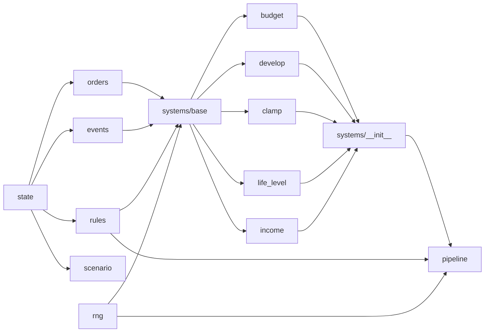

# Отчёт о спринте 1 — «Ядро движка»

**Проект:** World Arena (репозиторий `yakirill99/UN-not-model`)
**Период:** 28 сентября 2026 (спринт 0 и спринт 1 выполнены за один день)
**Ветки:** `rules/v1` → `dev` (PR #14, merge-commit `d5210cb`)
**Итог:** 68 тестов, mypy `--strict` для `arena.engine` без ошибок, критерий готовности из `DEV_PLAN.md` §7 выполнен.

---

## 1. Что было целью

По `DEV_PLAN.md` §7: *раунд считается по правилам из YAML через конвейер систем*. В этом спринте — каркас движка и первые пять систем; остальные механики (удары, санкции, помощь, конец раунда) — в спринте 2.

Критерий готовности: раунд, в котором страны инвестируют и запускают экопрограммы, считается из YAML, результат совпадает с ручным расчётом по формулам `GAME_RULES.md`, а **изменение цены в YAML меняет результат без правки кода**. Последнее закреплено тестом `test_changing_price_in_rules_changes_result`.

## 2. Хронология: спринт 0 + спринт 1 в PR

| PR | Ветка | Issue | Содержимое |
|---|---|---|---|
| #3 | `chore/v1-python-pin` | — | `backend/.python-version` = 3.13, чтобы локальный интерпретатор совпадал с CI и `mise.toml` |
| #9 | `feat/v1-state-orders` | #4 | `state.py`, `orders.py`, `events.py` + `test_models.py` |
| #10 | `feat/v1-rules-scenario` | #5 | `rules.py`, `scenario.py` + тесты; удалён `test_skeleton.py` |
| #11 | `feat/v1-pipeline-rng` | #6 | `pipeline.py`, `rng.py`, `systems/base.py` + `test_pipeline.py`, `test_determinism.py` |
| #12 | `feat/v1-systems-core` | #7 | `budget.py`, `develop.py`, `clamp.py`; поле `approved` в `RoundContext` |
| #13 | `feat/v1-systems-economy` | #8 | `life_level.py`, `income.py`, `Country.average_life_level` |
| #14 | `rules/v1` → `dev` | — | Закрытие спринта, обычный merge (история версии сохранена) |

Инфраструктура, настроенная по ходу: `dev` — ветка по умолчанию; защита `main`, `dev`, `rules/v1` (только через PR, обязательный check `Backend — lint, types, tests`); pre-commit (ruff, ruff-format, mypy, gitleaks, yaml/toml-проверки); метки и milestones из `scripts/github-bootstrap.sh`; Dependabot для GitHub Actions.

## 3. Модель ветвления

```text
main ──────────────────────────────────────────── стабильные релизы (теги v1.0, v2.0 …)
  └─ dev ───────────────────────────────────────── интеграция; ветка по умолчанию для PR
       └─ rules/v1 ──────────────────────────────── всё, что относится к правилам v1.x
            ├─ feat/v1-state-orders  → PR → squash в rules/v1
            ├─ feat/v1-rules-scenario
            ├─ …
            └─ (после спринта) rules/v1 → PR → merge в dev
```

Рабочий цикл одной задачи — строго в этом порядке, по одной команде:

1. `git switch rules/v1 && git pull` — на чистом дереве
2. `git switch -c feat/v1-<задача>` и `git branch --show-current` (убедиться, что на ветке задачи)
3. внести изменения (`tar xzf …`, правки)
4. `git status --short` — если пусто, что-то пошло не так, дальше не идти
5. тесты и mypy
6. `git add -A && git commit -m "feat(engine): … (#N)"`
7. `git push -u origin HEAD` — `HEAD` вместо имени ветки исключает ошибку «src refspec does not match»
8. `gh pr create --base rules/v1 …`, `gh pr checks --watch && gh pr merge --squash --delete-branch`

Два раза за спринт коммит попадал прямо в `rules/v1`, потому что цепочка `a && b && c` обрывалась на ошибке, а следующий вставленный блок выполнялся уже не там. Лечится `git switch -c feat/… ; git branch -f rules/v1 origin/rules/v1`. Отсюда правило «по одной команде» и защита `rules/v1`.

## 4. Структура движка после спринта

```text
backend/arena/engine/
├── state.py            модели состояния: City, Country, GameState (+ ArenaModel — общая база)
├── orders.py           приказы: CountryOrders, HostInput, OrderBook
├── events.py           события: Event и 6 конкретных классов, discriminated union, load/dump
├── rules.py            RuleSet и загрузка YAML: extends, deep-merge, проверки, JSON Schema
├── scenario.py         Scenario → начальный GameState
├── rng.py              RngFactory — детерминированные потоки случайности
├── pipeline.py         build_pipeline, resolve_round, PipelineError
├── actions.py          (заглушка — спринт 2)
├── observe.py          (заглушка — спринт 2)
└── systems/
    ├── __init__.py     импортирует модули систем → регистрация в реестре
    ├── base.py         System (Protocol), BaseSystem, RoundContext, SYSTEMS, @register
    ├── budget.py       проверка и списание по приоритетам
    ├── develop.py      инвестиции и экопрограммы
    ├── clamp.py        границы экологии и развития
    ├── life_level.py   уровень жизни городов
    └── income.py       доход и зачисление в бюджет

rules/v1.0.yaml         единственный источник чисел правил
scenarios/{smolny,equal}.yaml   стартовые условия
backend/tests/          unit/, unit/systems/, property/  — 68 тестов
```

Зависимости между модулями строго однонаправленные, циклов нет:



## 5. Файлы и их роль

### 5.1. `state.py` — что хранится между раундами

`ArenaModel` — общая база всех моделей движка с `extra="forbid"`: любое неизвестное поле в состоянии, приказе, событии или YAML — ошибка валидации, а не молчаливая потеря данных. Эту базу наследуют модели во всех остальных файлах.

| Модель | Поля | Инварианты |
|---|---|---|
| `City` | `id`, `name`, `development` (%), `shield`, `destroyed`, `life_level` (сотые доли %) | `development ≥ 0`, `life_level ≥ 0` |
| `Country` | `id`, `name`, `budget`, `cities`, `nuclear_tech`, `bombs`, `bombs_pending`, `laugh`, `aid_pending`, `sanctioned_by` | `budget ≥ 0`, id городов уникальны внутри страны |
| `GameState` | `round`, `ecology`, `countries`, `modules` (для v2/v3), `state_schema_version` | id стран уникальны; id городов уникальны глобально |

Все числа — целые (принцип 11 `ROADMAP.md`): `65` = 65 %, `5445` = 54,45 %. Хелперы, которыми пользуются системы: `GameState.country(id)`, `find_city(id) → (Country, City)`, `city_owner(id)`; `Country.city(id)`, `alive_cities`, `total_development`, `average_life_level` (уничтоженные города входят с нулём — §4.4 правил).

`budget ≥ 0` «по построению» означает: система `budget` обязана отклонять неоплачиваемое заранее, а не исправлять минус постфактум.

### 5.2. `orders.py` — что страны просят

`CountryOrders` описывает **намерение**, не результат: `invest: list[city_id]` (повтор id = несколько инвестиций), `eco_programs: int`, `nuclear_tech: bool`, `bombs: int`, `strikes`, `shields`, `sanctions`, `aid: {country_id: amount}`. Валидируются только структурные вещи (суммы > 0, счётчики ≥ 0); законность и оплата — дело движка.

`OrderBook.for_country(id)` возвращает пустые приказы для страны, которая ничего не подала (§12 шаг 1), так что системам не нужны проверки на `None`. `HostInput.laugh_winner` — ввод ведущего.

### 5.3. `events.py` — что движок сделал

Каждое изменение состояния описывается событием (принцип 5 `ROADMAP.md`). Базовый `Event`: `type`, `schema_version`, `round`, `actor` (id страны-причины), `target` (id страны или города). Конкретные события спринта:

| Событие | Кто создаёт | Полезная нагрузка |
|---|---|---|
| `OrderRejected` | budget | `action`, `reason`, `detail` |
| `BudgetSpent` | budget | `action`, `amount`, `budget_after` |
| `CityInvested` | develop | `development_before`, `development_after` |
| `EcologyChanged` | develop, clamp | `cause`, `delta`, `ecology_after` |
| `LifeLevelComputed` | life_level | `life_level` |
| `IncomeCredited` | income | `amount`, `budget_after` |

`AnyEvent` — discriminated union по полю `type`, поэтому сохранённый журнал восстанавливается в правильные классы: `load_events(dump_events(events)) == events`. В `load_events` есть точка для upcaster'ов: когда `EVENT_SCHEMA_VERSION` вырастет, старые журналы будут подниматься до текущей схемы, а не ломаться.

### 5.4. `rules.py` — правила как данные

`RuleSet` валидирует `rules/*.yaml`:

- `version` (semver), `extends`, `modules`, `pipeline` (список имён систем, без дублей), `params`, `actions`.
- `Params`: `rounds`, `ecology: {min, max}`, `life_weights`, `income` (коэффициенты), `laugh_bonus`, `budget_priority`.
- `ActionSpec` — одна типизированная модель на все действия с опциональными полями (`cost`, `effect`, `target`, `requires`, `once_per_game`, `max_per_round`, `max_per_city_per_round`, `usable`, `active`, `available`, `anonymous`, `duration_rounds`, `visible_to_target`, `min_amount`, `ui`). Поле, неприменимое к действию, просто остаётся в дефолте.
- Проверки согласованности: `budget_priority` и `requires` ссылаются только на существующие действия.

**`extends`** реализован как deep-merge: вложенные мапы сливаются по ключам, списки и скаляры заменяются, явный `null` удаляет ключ родителя. Файл из трёх строк

```yaml
version: "1.1.0"
extends: v1.0
actions: {invest: {cost: 100}}
```

даёт полный валидный набор правил, отличающийся только ценой инвестиции. Цикл `extends` и отсутствующий файл — понятная `RulesError`.

Доступ к числам из систем — только через `rules.cost("invest")`, `rules.effect("invest", "development")` (нет ключа → 0), `rules.action("bomb").max_per_round`, `rules.params.*`. В Python-коде движка нет ни одного числа из правил.

`rules_json_schema()` экспортирует JSON Schema — для валидации в редакторе, формы во фронтенде и схемы ответа LLM (спринты 5 и далее).

### 5.5. `scenario.py` — стартовые условия

`Scenario` (`id`, `title`, `ecology`, `countries`) переиспользует `Country`/`City` из `state.py`; всё, чего нет в файле (бомбы, санкции, щиты), берётся из дефолтов моделей. `Scenario.initial_state()` → `GameState(round=1, …)`. Сценарии `smolny.yaml` (исторический старт из координаторской таблицы) и `equal.yaml` (240 % развития и 1000 $ у всех) грузятся и проверяются тестами.

### 5.6. `rng.py` — управляемая случайность

`RngFactory(game_seed, round_no).for_system("strikes")` возвращает `numpy.random.Generator` с сидом `SeedSequence([seed, round, stable_id(name)])`. `stable_id` — первые 8 байт SHA-256 от имени системы: встроенный `hash()` в Python солится при каждом запуске процесса и для воспроизводимости непригоден.

Следствие: у каждой системы свой независимый поток; добавление новой случайной механики (события v2, кризисы v3) не сдвигает числа, которые тянут существующие системы, — golden-тесты и реплеи не ломаются. В спринте 1 ни одна система случайность не использует; каркас проверен property-тестом с системой-заглушкой.

### 5.7. `systems/base.py` — контракт системы

```python
@dataclass(frozen=True, slots=True)
class RoundContext:
    rules: RuleSet
    rng: RngFactory
    round: int
    approved: dict[str, CountryOrders]   # заполняет resolve_round, переписывает budget

class System(Protocol):
    name: ClassVar[str]
    def __init__(self, rules: RuleSet) -> None: ...
    def apply(self, state: GameState, orders: OrderBook, ctx: RoundContext) -> list[Event]: ...
```

- `BaseSystem` хранит `rules` и даёт `self.rng(ctx)` — поток этой системы.
- `@register("budget")` кладёт класс в глобальный `SYSTEMS` и проставляет `name`; повторная регистрация другого класса под тем же именем — ошибка.
- `apply()` **мутирует рабочую копию состояния** и возвращает события. Никаких побочных эффектов, никакого чтения `random`/времени.

`ctx.approved` — единственное проектное решение спринта, не описанное в `DEV_PLAN`. Системам после `budget` нужно знать, что реально оплачено, а `apply()` возвращает только события. Класть это в `state.modules` значило бы засорять сохраняемое состояние временными данными раунда. Поэтому в frozen-контексте живёт изменяемый словарь: `resolve_round` заполняет его сырыми приказами всех стран, `budget` заменяет каждую запись тем, что страна смогла оплатить, а исполняющие системы читают только `ctx.approved`.

### 5.8. `pipeline.py` — единственная точка входа

```python
def resolve_round(state, orders, rules, seed) -> tuple[GameState, list[Event]]
```

1. `build_pipeline(rules)` — по `rules.pipeline` собирает экземпляры систем; незарегистрированное имя → `PipelineError` со списком того, что зарегистрировано. Делается **до** копирования состояния — падать надо раньше, чем что-то трогать.
2. `work = state.model_copy(deep=True)` — функция чистая, исходное состояние не меняется (проверяется и по равенству дампа, и по identity вложенных объектов).
3. `RoundContext` с `RngFactory(seed, state.round)` и `approved`.
4. Системы применяются по порядку, события накапливаются.

Порядок раунда — не в коде, а в `rules/v1.0.yaml`: `pipeline: [budget, aid, build, develop, strikes, sanctions, clamp, life_level, income, laugh, end_of_round]`. v2 вставит `stability`, `rating`, `resolutions` в нужные места этого списка.

### 5.9. Системы спринта 1

**`budget`** (§12 шаги 2–3, решение 13 из §17). Приказ каждой страны разбирается на единицы — одна инвестиция, один щит, одна бомба, один перевод, — единицы сортируются по `params.budget_priority` (`shield → invest → eco_program → nuclear_tech → bomb → aid`) и оплачиваются по очереди, пока хватает денег. Оплаченная единица → `BudgetSpent` и запись в `ctx.approved`; неоплаченная → `OrderRejected(reason="insufficient_budget")`. Восемь инвестиций в Москву при 1000 $ дают шесть исполненных и два отказа.

Здесь же — проверки, влияющие на оплату, каждая со своим `reason`: `not_own_city`, `city_destroyed`, `already_shielded`, `already_owned` (технология), `requires_nuclear_tech` (технология, заказанная в этом же раунде, открывает производство), `limit_exceeded` (бомбы > `max_per_round`), `self_target`, `unknown_country`, `below_minimum` (помощь). Бесплатные действия — удары и санкции — бюджет не трогает; их законность проверят собственные системы в спринте 2.

**`develop`** (§12 шаг 6). Для каждого города из `approved.invest`: `development += rules.effect("invest","development")`, событие `CityInvested`. За каждую экопрограмму: `ecology += rules.effect("eco_program","ecology")`, событие `EcologyChanged(cause="eco_program")`.

**`clamp`** (§12 шаг 9). Экология в `params.ecology.min..max` (событие `EcologyChanged(cause="clamp")`, если срезано), развитие ≥ 0.

**`life_level`** (§5). `life_level = w_d·development + w_e·ecology + w_l·laugh`, веса `33` работают как 0,33, результат — в сотых долях процента. Пример из правил: 65 / 100 / 0 → **5445**. Уничтоженный город — 0, но в `average_life_level` входит.

**`income`** (§5, §12 шаг 11). `(k_d·development + k_e·ecology) // 100` на город, уничтоженный — 0; сумма зачисляется в `budget`, событие `IncomeCredited`. Пример из правил: 65 / 100 → **215 $**. Считается по **новым** показателям, поэтому стоит после `develop`/`clamp`.

## 6. Как проходит раунд — сквозной пример

Сценарий `equal`, Россия подаёт `invest=[moscow, moscow, spb], eco_programs=1` (в конвейере только системы спринта 1):

```mermaid
sequenceDiagram
    participant R as resolve_round
    participant B as budget
    participant D as develop
    participant C as clamp
    participant L as life_level
    participant I as income
    R->>R: build_pipeline, deep copy, ctx.approved = сырые приказы
    R->>B: apply
    B->>B: единицы: invest×3 (150), eco×1 (200) → все по карману
    B-->>R: BudgetSpent×4; approved[russia] = те же приказы; budget 1000→350
    R->>D: apply
    D-->>R: CityInvested×3 (Москва 60→75→90, СПб 60→75), EcologyChanged +30 (130)
    R->>C: apply
    C-->>R: EcologyChanged(clamp) −30 → 100
    R->>L: apply
    L-->>R: LifeLevelComputed×20 (Москва 33·90+33·100 = 6270)
    R->>I: apply
    I-->>R: IncomeCredited (Россия: 240+60·3+150·4 = 930; budget 350→1280)
    R-->>R: (new_state, events)
```

Исходный `state` при этом не изменился — тест `test_resolve_round_is_pure`.

## 7. Тесты

| Файл | Тестов | Что закрепляет |
|---|---|---|
| `unit/test_models.py` | 14 | round-trip JSON, `extra="forbid"`, уникальность id, хелперы, discriminated union событий, ошибка на новой схеме |
| `unit/test_rules_loading.py` | 12 | загрузка v1.0, опечатка → ошибка, `extends` меняет только названное, `null` удаляет ключ, цикл, JSON Schema |
| `unit/test_scenario.py` | 9 | оба сценария, 5×4, `equal` сбалансирован, `smolny` совпадает с таблицей, дубли id → ошибка |
| `unit/test_pipeline.py` | 6 | порядок систем из YAML, незарегистрированная система, чистота, регистрация |
| `property/test_determinism.py` | 4 | независимость потоков RNG, hypothesis: одинаковые входы → одинаковый выход |
| `unit/systems/test_budget.py` | 9 | приоритеты при нехватке денег, частичное исполнение, все причины отказа, бюджет ≥ 0 |
| `unit/systems/test_develop.py` | 5 | +15 за инвестицию, повторы, экология ≤ 100, неоплаченное не действует, **цена из YAML меняет результат** |
| `unit/systems/test_life_level.py` | 5 | 65/100 → 5445, уничтоженный город, смех, среднее по стране |
| `unit/systems/test_income.py` | 4 | 65/100 → 215 $, уничтоженный город, доход по новым показателям |

Фикстура `run(pipeline, **orders)` в `unit/systems/conftest.py` собирает конвейер из нужных систем на реальных правилах v1.0 и сценарии `equal` — каждая система тестируется изолированно, но через настоящий `resolve_round`. Тесты конвейера подменяют глобальный реестр `SYSTEMS` заглушками и восстанавливают его после себя.

## 8. Что осталось и известные ограничения

- Полный `pipeline` из `v1.0.yaml` пока **не запускается**: нет `aid`, `build`, `strikes`, `sanctions`, `laugh`, `end_of_round`. `build_pipeline` на нём падает с `PipelineError` — по замыслу. Пока их нет, `budget` уже списывает деньги за щиты, технологию, бомбы и помощь, но эффект не применяется.
- `Params` — `extra="forbid"`; параметры модулей v2 (`stability`, `rating`) туда не влезут. Добавим `module_params` тогда, когда появится v2, не раньше.
- `City.life_level ≥ 0` — если в v2 появятся отрицательные значения, ограничение снимем.
- `income` делит нацело; на параметрах v1.0 остатка не бывает.
- `actions.py`, `observe.py` — заглушки с docstring.

## 9. Спринт 2 — что дальше

Issue #15–#20, milestone «Спринт 2 — Полный движок v1.0»:

1. `aid`, `build`, `strikes`, `sanctions` (#15)
2. `laugh`, `end_of_round`; полный конвейер v1.0; `test_rules_contract` (#16)
3. `observe`, `legal_actions`, `validate` — секретность (#17)
4. Property-тесты инвариантов (#18)
5. `Agent`, `ScriptedAgent`, `run_game`, `replay`, `GameLog`, CLI `play` (#19)
6. Реплей Смольного и отчёт о расхождениях (#20). Исходники есть: «Ответы» (приказы годов 1–3, включая свободный текст вроде «Плюс ещё щит Исфахан и Йезд»), «Копия Координаторская» (состояния), таблицы стран.

Критерий готовности спринта 2: покрытие `arena.engine` ≥ 90 %, реплей проходит, отчёт написан, партия играется в терминале.
