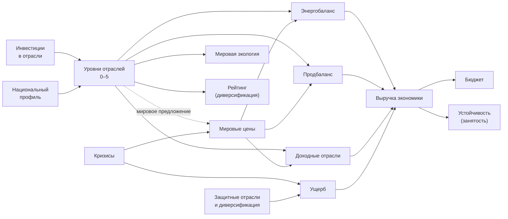

# «Мировая Арена» — версия 3: отраслевая экономика и кризисы

Документ дополняет `GAME_RULES.md` (база) и `GAME_RULES_2.md` (устойчивость, рейтинг, ООН). Всё, что здесь не упомянуто, работает по предыдущим версиям.

**Статус:** проект. Числа — стартовые значения для симуляций. Стартовая экономика стран в разделе 5 проверена расчётом, остальной баланс требует прогонов.

---

## Содержание

1. [Идея и место в игре](#1-идея-и-место-в-игре)
2. [Принципы](#2-принципы)
3. [Модель экономики в одной схеме](#3-модель-экономики-в-одной-схеме)
4. [Десять отраслей](#4-десять-отраслей)
5. [Национальные профили](#5-национальные-профили)
6. [Развитие отраслей](#6-развитие-отраслей)
7. [Энергетический и продовольственный балансы](#7-энергетический-и-продовольственный-балансы)
8. [Мировые цены](#8-мировые-цены)
9. [Выручка и доход страны](#9-выручка-и-доход-страны)
10. [Торговля и санкции](#10-торговля-и-санкции)
11. [Диверсификация](#11-диверсификация)
12. [Связь с остальными механиками](#12-связь-с-остальными-механиками)
13. [Кризисы](#13-кризисы)
14. [Антикризисные меры](#14-антикризисные-меры)
15. [Почему не получится играть по шаблону](#15-почему-не-получится-играть-по-шаблону)
16. [Интерфейс](#16-интерфейс)
17. [Порядок обработки раунда](#17-порядок-обработки-раунда)
18. [Пример: подготовка к пандемии](#18-пример-подготовка-к-пандемии)
19. [Баланс: параметры и гипотезы](#19-баланс-параметры-и-гипотезы)
20. [Внедрение: от 6 отраслей к 10](#20-внедрение-от-6-отраслей-к-10)
21. [Что это даёт как DS-проект](#21-что-это-даёт-как-ds-проект)
22. [Открытые вопросы](#22-открытые-вопросы)

---

## 1. Идея и место в игре

У каждой страны есть экономика из десяти отраслей. Страны вкладываются в отрасли по своему выбору, но у каждой есть национальные и исторические преимущества: в «свою» отрасль вкладываться дешевле и выгоднее. Мировые цены зависят от того, во что вкладываются все, а случайные кризисы разной силы бьют по разным отраслям. Защититься от кризиса можно заранее, развивая профильную отрасль, или в моменте, антикризисными мерами.

**Главная цель:** сделать так, чтобы у экономики не было одного оптимального паттерна.

**Главное ограничение:** экономика должна порождать поводы для дипломатии — торговые соглашения, совместную борьбу с кризисами, санкции с реальным весом. Если экономика замыкается сама в себе, игра превращается в оптимизацию таблиц и уходит от темы ООН.

---

## 2. Принципы

1. **Всё считает сервер.** Игрок принимает 1–2 экономических решения за раунд и видит результат и прогноз.
2. **Рынок важнее случайности.** Лучшая стратегия зависит от действий других стран через цены. Случайные кризисы — второй слой.
3. **Кризис можно предвидеть.** Каждому кризису предшествует прогноз аналитиков, который обычно (но не всегда) верен.
4. **Преимущество, а не предопределённость.** Национальный профиль делает одни отрасли выгоднее, но не запрещает другие.
5. **Два баланса вместо цепочек.** Полные производственные цепочки перегружают игру. Взаимозависимость держится на энергии и продовольствии.
6. **Устойчивость против доходности.** Узкая специализация приносит больше денег, диверсификация защищает от кризисов. Это главный экономический выбор.

---

## 3. Модель экономики в одной схеме



Экономика отраслей **дополняет** доход городов из базовых правил, а не заменяет его. Города остаются «налоговой базой» и определяют уровень жизни, отрасли — это то, чем страна зарабатывает и за счёт чего переживает кризисы.

---

## 4. Десять отраслей

Отрасли объединены в 4 группы, чтобы игрок видел не десять цифр, а четыре блока.

| Группа | Отрасль | Код | Тип | Базовое значение за уровень | Экология за уровень в раунд |
|---|---|---|---|---|---|
| ⚡ Энергетика | Нефть и газ | НГ | Энергия | 12 ед. энергии | −0,3 п.п. |
| | Атомная энергетика | АЭ | Энергия | 10 ед. энергии | 0 |
| | Возобновляемая энергетика | ВИЭ | Энергия | 6 ед. энергии | +0,4 п.п. |
| 🌾 Ресурсы | Сельское хозяйство | Агро | Продовольствие | 12 ед. продовольствия | 0 |
| | Металлургия и добыча | Мет | Доход | 30$ | −0,3 п.п. |
| 🏭 Промышленность | Машиностроение | Маш | Доход | 40$ | −0,15 п.п. |
| | Электроника | Эл | Доход | 60$ | 0 |
| | Оборонная промышленность | ВПК | Доход | 30$ | 0 |
| 🏦 Услуги | Фармацевтика и медицина | Фарма | Доход | 35$ | 0 |
| | Финансы и IT | Фин | Доход | 50$ | 0 |

### Особые эффекты отраслей

| Отрасль | Эффект помимо дохода | Слабое место |
|---|---|---|
| **НГ** | Самый большой источник энергии; экспорт приносит много денег | Самая волатильная цена; загрязняет экологию |
| **АЭ** | С 3-го уровня ядерная технология стоит 350$ вместо 500$ | Двойное назначение: инспекция МАГАТЭ раскрывает и уровень АЭ |
| **ВИЭ** | Улучшает мировую экологию | Мало энергии за уровень |
| **Агро** | Продовольственная безопасность | Засухи и климатические аномалии |
| **Мет** | Защищает от сбоев цепочек поставок | Загрязняет экологию; промышленные аварии |
| **Маш** | Защищает от последствий аварий и стихийных бедствий | Потребляет энергию |
| **Эл** | Самый высокий доход за уровень | Уязвима к сбоям поставок и кибератакам |
| **ВПК** | С 2-го уровня бомбы на 25$ дешевле, с 4-го — бомбы на 50$ и щиты на 50$ дешевле | −2 к оценке рейтинга за каждый уровень |
| **Фарма** | +1 к устойчивости за уровень каждый раунд (не больше +5); защищает от пандемий | Скромный доход |
| **Фин** | +2 к оценке рейтинга за уровень; защищает от кибератак | Финансовые кризисы бьют сильнее всего |

Максимальный уровень отрасли — **5**.

---

## 5. Национальные профили

Профиль состоит из двух частей:
- **стартовые уровни** — историческое наследие;
- **множители** — природные и исторические условия.

| Обозначение | Множитель выпуска | Стоимость развития |
|---|---|---|
| ★ Национальное преимущество | ×1,3 | ×0,75 |
| · Обычная отрасль | ×1,0 | ×1,0 |
| ▼ Слабое место | ×0,8 | ×1,25 |

### Стартовые уровни (режим «Исторический»)

| Отрасль | 🇷🇺 Россия | 🇺🇸 США | 🇫🇷 Франция | 🇮🇷 Иран | 🇰🇵 КНДР |
|---|---|---|---|---|---|
| НГ | **4** ★ | 2 | 0 ▼ | **5** ★ | 0 |
| АЭ | **3** ★ | 1 | **4** ★ | 1 | 1 |
| ВИЭ | 0 | 0 | 1 | 0 | 2 |
| Агро | 2 | 2 | 2 ★ | 2 ★ | 1 ▼ |
| Мет | 2 | 0 ▼ | 1 | 2 ★ | **3** ★ |
| Маш | 1 | 0 ▼ | 2 | 1 | 2 ★ |
| Эл | 0 ▼ | **3** ★ | 0 ▼ | 0 ▼ | 0 |
| ВПК | 2 ★ | 2 ★ | 1 | 2 | **4** ★ |
| Фарма | 0 | 1 | 2 ★ | 1 | 1 |
| Фин | 0 ▼ | **3** ★ | 1 | 0 ▼ | 0 ▼ |
| **Сумма уровней** | 14 | 14 | 14 | 14 | 14 |

Профили — игровая абстракция по мотивам реальных экономик, а не их точное описание.

### Стартовая экономика (расчёт при ценах 1,0)

| Страна | Энергия: выпуск / потребление | Сальдо энергии | Сальдо продовольствия | Доходные отрасли | **Выручка экономики** | Экология в раунд |
|---|---|---|---|---|---|---|
| Россия | 101 / 30 | +257$ | +18$ | 178$ | **453$** | −1,95 |
| США | 34 / 30 | +14$ | +18$ | 542$ | **574$** | −0,60 |
| Франция | 58 / 28 | +108$ | +50$ | 281$ | **439$** | −0,20 |
| Иран | 88 / 30 | +209$ | +50$ | 213$ | **472$** | −2,25 |
| КНДР | 22 / 38 | −70$ | −57$ | 412$ | **284$** | −0,40 |

Для сравнения: доход городов по базовым правилам — 800–1 100$ в раунд. Отрасли дают около трети дохода: заметно, но не всё.

Что видно из расчёта:
- У экспортёров энергии (Россия, Иран) деньги держатся на одной цене, у США — на финансах и электронике. Разные кризисы бьют по ним по-разному.
- **КНДР — самая сложная экономика**: дефицит энергии и продовольствия. В историческом режиме это компенсируется чертами из v2 (дешёвые бомбы, санкции не бьют по устойчивости), но всё равно требует проверки симуляциями.
- Мировая экология теряет около **5,4 п.п. за раунд** только от экономики. Без экологических программ за 6 раундов это −32 п.п. Трагедия общин теперь встроена в сам рост.

### Режим «Соревновательный»

Все страны стартуют с одинаковыми уровнями (по 1 в каждой отрасли, кроме Эл и Фин — по 2, сумма 12). Профили ★/▼ сохраняются как множители, поэтому страны всё равно различаются по стилю, но стартуют на равных.

---

## 6. Развитие отраслей

### Стоимость повышения уровня

```text
Стоимость = 60$ × (Текущий уровень + 1) × Коэффициент профиля
```

| Переход | ★ Преимущество | · Обычная | ▼ Слабое место |
|---|---|---|---|
| 0 → 1 | 45$ | 60$ | 75$ |
| 1 → 2 | 90$ | 120$ | 150$ |
| 2 → 3 | 135$ | 180$ | 225$ |
| 3 → 4 | 180$ | 240$ | 300$ |
| 4 → 5 | 225$ | 300$ | 375$ |

### Правила

- За раунд можно повысить **не больше двух отраслей**, каждую — на один уровень.
- Новый уровень начинает работать **со следующего раунда** (строительство занимает год). Поэтому к кризису готовятся заранее.
- Понизить уровень нельзя, но уровень может упасть от кризиса или потери городов.
- Окупаемость на средних уровнях — 2–4 раунда, на высоких — дольше. Поздно вкладываться в высокие уровни невыгодно, и это нормально: в конце игры деньги нужнее для устойчивости и защиты.

---

## 7. Энергетический и продовольственный балансы

Взаимозависимость стран держится на двух балансах. Их считает сервер, игрок видит итог: «профицит +12» или «дефицит −8».

### Энергия

```text
Выпуск энергии    = Σ (Уровень × Энергия за уровень × Множитель профиля)   по НГ, АЭ, ВИЭ
Потребление       = 20 + 2 × (Уровень Мет + Маш + Эл + ВПК)
Энергобаланс      = Выпуск − Потребление
```

База 20 — бытовое потребление населения. Промышленность увеличивает потребление, поэтому индустриальным странам нужна энергетика или импорт.

### Продовольствие

```text
Выпуск продовольствия = Уровень Агро × 12 × Множитель профиля
Потребление           = 20
Продбаланс            = Выпуск − Потребление
```

### Что происходит с балансом

| Баланс | Результат |
|---|---|
| Профицит | Излишек автоматически продаётся на мировом рынке по **экспортной цене** |
| Дефицит | Недостаток автоматически покупается по **импортной цене** и списывается из бюджета |
| Дефицит, а денег на импорт не хватает | **Энергетический кризис в стране** (−10 к устойчивости, доходные отрасли дают −30%) или **голод** (−15 к устойчивости, −10 п.п. развития всем городам) |

---

## 8. Мировые цены

### Базовые цены

| Товар | Базовая цена единицы | Экспорт | Импорт |
|---|---|---|---|
| Энергия | 4$ × Индекс энергии | 90% цены | 110% цены |
| Продовольствие | 5$ × Индекс продовольствия | 90% цены | 110% цены |

Доходные отрасли (Мет, Маш, Эл, ВПК, Фарма, Фин) имеют собственные индексы цен.

Разница между экспортной и импортной ценой (10% в каждую сторону) — это «цена рынка». Зависеть от импорта всегда немного дороже, чем производить самому.

### Как меняется индекс цены

Каждый раунд у каждого индекса:

```text
Индекс_новый = Индекс + 0,3 × (1 − Индекс)      ← возврат к норме
                       − 0,5 × Рост мирового выпуска
                       + σ × ε                    ← рыночный шум
                       + Шок кризиса
```

- **Возврат к норме:** цены стремятся к 1,0. Пик после кризиса постепенно сходит на нет.
- **Рост мирового выпуска:** относительный рост суммарного выпуска товара во всём мире. Если суммарный выпуск энергии вырос на 20%, индекс энергии падает на 0,1. **Если все вкладываются в одно и то же, это перестаёт быть выгодным.**
- **Рыночный шум:** ε — случайное число из стандартного нормального распределения, σ — волатильность.
- Индекс ограничен диапазоном **0,4–2,0**.

### Волатильность

| Индекс | σ | Характер |
|---|---|---|
| Энергия | 0,10 | Скачет, особенно с кризисами |
| Продовольствие | 0,06 | Относительно стабилен |
| Мет | 0,06 | Средний |
| Маш | 0,04 | Стабильный |
| Эл | 0,08 | Высокий, тянется за технологическими трендами |
| ВПК | 0,03 | Почти неподвижен |
| Фарма | 0,04 | Стабильный, растёт в пандемии |
| Фин | 0,10 | Высокий |

---

## 9. Выручка и доход страны

### Выручка доходной отрасли

```text
Выручка = Уровень × Базовое значение × Множитель профиля × Индекс цены × Доля живых городов
```

**Доля живых городов** = число неуничтоженных городов / 4. Потеря города бьёт не только по уровню жизни, но и по экономике: заводы и офисы тоже были в этом городе.

### Выручка экономики

```text
Выручка экономики = Σ Выручка доходных отраслей
                  + Сальдо энергии (экспорт − импорт)
                  + Сальдо продовольствия
                  − Ущерб от кризисов
```

Выпуск энергии и продовольствия тоже умножается на долю живых городов.

### Итоговый доход страны за раунд

```text
Доход = (Доход городов + Выручка экономики)
        × Модификатор устойчивости      (из v2)
        × Модификатор климата           (из v2)
        + Частный капитал               (из v2)
        + Бонусы черт и технологий
```

---

## 10. Торговля и санкции

### Мировой рынок

По умолчанию все излишки и недостатки автоматически проходят через мировой рынок. Игроку ничего не нужно делать.

### Санкции

Теперь санкции бьют по торговле:

| Ситуация | Эффект на торговлю цели |
|---|---|
| Каждая индивидуальная санкция | Импорт +10% к цене, экспорт −10% выручки |
| Режим санкций ООН | Импорт +30% к цене, экспорт −30% выручки |

Эффект складывается с санкционными эффектами из v1 и v2. Для экспортёров энергии санкции стали по-настоящему болезненными, а для стран с дефицитом — опасными.

### Торговые соглашения (двусторонние)

Опциональная механика для тех, кто хочет договариваться.

- Две страны на переговорах договариваются: «Страна A поставляет стране B **N единиц** энергии или продовольствия по **фиксированной цене** на **K раундов**».
- Обе страны вносят соглашение в форму приказов. Если записи совпадают, движок его исполняет.
- Поставка идёт до расчёта с мировым рынком. Если у продавца не хватает товара, он докупает его на рынке сам.
- Соглашение нельзя разорвать без последствий: разрыв даёт −10 к рейтингу нарушителя и объявляется в новостях.
- Санкции между участниками соглашения его не разрывают, но нарушают дух договорённостей — повод для дебатов.

Зачем это нужно: фиксированная цена защищает обе стороны от скачков рынка. В кризис такой договор становится очень ценным, и за него стоит торговаться.

---

## 11. Диверсификация

Движок считает, насколько экономика страны опирается на разные отрасли.

```text
Доля отрасли      sᵢ = (Уровеньᵢ × Множительᵢ) / Σ (Уровень × Множитель)
Концентрация      HHI = Σ sᵢ²
Эффективное число отраслей   N = 1 / HHI
Индекс диверсификации   D = 100 × (N − 1) / 9
```

Игрок видит понятную формулировку: «экономика опирается примерно на 5 отраслей (D = 50)».

| Индекс D | Пример | Смысл |
|---|---|---|
| 0 | Одна отрасль | Монокультура |
| ~40–50 | Россия (42), Франция (50) на старте | Средняя диверсификация |
| 100 | Все 10 отраслей одинаково развиты | Идеальная диверсификация |

### Эффекты

| Эффект | Формула | Диапазон |
|---|---|---|
| Множитель ущерба от кризисов | 1,3 − 0,6 × D / 100 | от ×1,3 (монокультура) до ×0,7 |
| Модификатор оценки рейтинга | (D − 40) / 3 | от −13 до +20 |

Это главный экономический выбор: специализация в «своих» отраслях приносит больше денег, диверсификация делает страну устойчивее к кризисам и привлекательнее для инвесторов.

---

## 12. Связь с остальными механиками

| Механика | Как на неё влияет экономика |
|---|---|
| **Мировая экология** | Каждый раунд: НГ −0,3, Мет −0,3, Маш −0,15, ВИЭ +0,4 п.п. за уровень во всём мире |
| **Устойчивость** | Фарма: +1 за уровень (до +5). Падение выручки экономики больше 20% к прошлому раунду — «рост безработицы»: −5; больше 40% — −10 |
| **Рейтинг** | Фин +2 за уровень, ВПК −2 за уровень, диверсификация (D − 40) / 3 |
| **Ядерная программа** | АЭ ≥ 3 удешевляет технологию; ВПК удешевляет бомбы и щиты |
| **Удары по городам** | Каждый уничтоженный город снижает выпуск всех отраслей на 25% |
| **Резолюции ООН** | Инспекция раскрывает уровни АЭ и ВПК. Новая резолюция — «Международный антикризисный фонд» (раздел 14) |
| **Технологии v2** | «Индустриализация» (+10% к доходу) применяется и к выручке экономики. Новая технология «Аналитический центр» (раздел 13) |

---

## 13. Кризисы

### Как возникают

В конце каждого раунда движок разыгрывает кризисы **на следующий раунд**:

| Число кризисов в раунде | Вероятность |
|---|---|
| 0 | 35% |
| 1 | 50% |
| 2 | 15% |

Тип кризиса выбирается из таблицы ниже с весами. Веса меняются от состояния мира: климатические кризисы становятся вероятнее при низкой экологии, торговые войны — при множестве санкций, кибератаки чаще бьют по странам с развитыми Фин и Эл.

### Сила кризиса

| Сила | Вероятность | Множитель k |
|---|---|---|
| Лёгкий | 50% | 0,5 |
| Серьёзный | 35% | 1,0 |
| Тяжёлый | 15% | 1,8 |

### Масштаб

| Масштаб | Кого затрагивает |
|---|---|
| Глобальный | Все страны |
| Региональный | 2 случайные страны |
| Локальный | 1 страна (выбирается с весами по подверженности) |

### Прогноз аналитиков

В фазе новостей публикуется прогноз на следующий раунд: тип и примерная сила ожидаемого кризиса. Прогноз **верен с вероятностью 70%**; в остальных случаях аналитики ошибаются в типе или силе. Технология «Аналитический центр» (уровень I экономической ветки вместо «Индустриализации» или отдельной технологией — открытый вопрос) повышает точность прогнозов для своей страны до 85%.

Так случайность остаётся, но у игроков есть шанс подготовиться: уровень отрасли, вложенный сейчас, заработает как раз к кризису.

### Формула ущерба

```text
Ущерб = Базовый эффект × k × Подверженность × (1 − Защита) × Множитель диверсификации

Защита = min(75%, 15% × Уровень защитной отрасли)
```

**Подверженность** — доля выручки страны в поражённых отраслях (для отраслевых кризисов) или 1 (для кризисов, бьющих по населению).

### Таблица кризисов

| # | Кризис | Масштаб | Базовый эффект (× k) | Защита | Длительность |
|---|---|---|---|---|---|
| 1 | ⚡ **Энергетический кризис** | Глобальный | Индекс энергии +0,5; импортёры энергии −3 к устойчивости | Собственная генерация: чем меньше дефицит, тем меньше ущерб | 2 раунда |
| 2 | 🛢️ **Обвал цен на нефть** | Глобальный | Индекс энергии −0,4 | Диверсификация | 1 раунд |
| 3 | 🦠 **Пандемия** | Глобальный | Выручка Мет, Маш, Эл, ВПК, Фин −15%; Фарма +30%; −8 к устойчивости | Фарма | 2 раунда |
| 4 | 🌾 **Засуха** | Региональный | Выпуск продовольствия −40%; индекс продовольствия во всём мире +0,3 | Агро | 1 раунд |
| 5 | 💸 **Финансовый кризис** | Глобальный | Выручка Фин −50%; пул частного капитала −50%; −4 к устойчивости | Только диверсификация | 1 раунд |
| 6 | 🔗 **Сбой цепочек поставок** | Глобальный | Выручка Эл и Маш −40% | Мет | 1 раунд |
| 7 | 💻 **Кибератака** | Локальный | Выручка Фин и Эл −50%; −5 к оценке рейтинга | Фин (10% за уровень вместо 15%) | 1 раунд |
| 8 | 🏭 **Промышленная авария** | Локальный | Экология −4 п.п.; одна из отраслей НГ, АЭ или Мет теряет уровень; −5 к устойчивости | Маш | Разово |
| 9 | 🌪️ **Стихийное бедствие** | Локальный | Случайный город −20 п.п. развития; −3 к устойчивости | Маш | Разово |
| 10 | 🌡️ **Климатическая аномалия** | Глобальный | Выпуск продовольствия −20%; −3 к устойчивости | ВИЭ | 1 раунд |
| 11 | ⚔️ **Торговая война** | Две страны | Экспортная выручка обеих −30% | Диверсификация; прекращается торговым соглашением между ними или резолюцией ООН | 2 раунда |
| 12 | 🚀 **Технологический бум** *(позитивный)* | Глобальный | Индексы Эл и Фин +0,4 | — | 1 раунд |
| 13 | 🌽 **Рекордный урожай** *(позитивный)* | Глобальный | Выпуск продовольствия +30%; индекс продовольствия −0,2 | — | 1 раунд |
| 14 | ⛏️ **Открытие месторождения** *(позитивный)* | Локальный | НГ или Мет +1 уровень бесплатно | — | Разово |

### Веса типов

| Условие | Изменение веса |
|---|---|
| Базовые веса | Все кризисы равновероятны, позитивные — вдвое реже |
| Экология < 60% | Климатическая аномалия и засуха ×2 |
| Экология < 30% | Климатическая аномалия и засуха ×3 |
| 3+ активные санкции в мире | Торговая война ×2 |
| Пандемия была в последние 2 раунда | Пандемия ×0 (не повторяется подряд) |

### Связь с колодой событий v2

Кризисы v3 **заменяют экономические события** колоды из v2 (финансовый кризис, инвестиционный бум, нефтяной шок, пандемия, стихийное бедствие). В колоде остаются политические события: саммит ООН, олимпиада, утечка документов, волна протестов, климатический и научный саммиты.

---

## 14. Антикризисные меры

Когда кризис объявлен в новостях, у страны есть три способа ответить.

### 1. Подготовка заранее

Развивать защитную отрасль по прогнозу аналитиков. Самый дешёвый способ, но работает только если прогноз верен и уровень построен заранее.

### 2. Антикризисный пакет (новое действие)

| Параметр | Значение |
|---|---|
| Стоимость | 150$ × k (от 75$ до 270$) |
| Эффект | Ущерб от одного кризиса этого раунда для своей страны −50% |
| Ограничение | Один пакет на кризис |

Дороже подготовки, но работает гарантированно и в тот же раунд.

### 3. Международный антикризисный фонд (новая резолюция ООН)

| Параметр | Значение |
|---|---|
| Условие | Только в раунде, когда действует глобальный кризис |
| Взнос | Каждая страна платит 100$ |
| Эффект | Ущерб от этого кризиса для всех стран −25%; суммируется с антикризисным пакетом |
| Нарушение | Страна, не заплатившая взнос, не получает защиты и становится нарушителем резолюции |

Это ООН в чистом виде: общая беда, коллективный ответ и соблазн отсидеться за счёт остальных.

---

## 15. Почему не получится играть по шаблону

| Источник изменчивости | Как ломает шаблон |
|---|---|
| **Цены зависят от других игроков** | Если все пошли в нефть, нефть дешевеет. Лучшая стратегия зависит от поведения соперников |
| **Случайный тип, сила и масштаб кризисов** | Каждая партия — своя последовательность из 6–9 кризисов |
| **Неточные прогнозы** | 30% прогнозов ошибаются: подготовка всегда немного ставка |
| **Задержка строительства** | Реагировать приходится заранее, а не по факту |
| **Выбор между доходом и защитой** | Специализация богатеет, диверсификация выживает — баланс зависит от того, какие кризисы выпадут |
| **Рыночный шум** | Даже без кризисов цены никогда не повторяются |
| **Разные профили стран** | Каждая страна решает свою задачу |

Все случайности генерируются из зерна (seed) игры. Партию можно воспроизвести целиком для разбора или тестов.

---

## 16. Интерфейс

### Карточка экономики

- **4 блока групп** (Энергетика, Ресурсы, Промышленность, Услуги) с уровнями отраслей, звёздами преимуществ и выручкой.
- **Балансы:** энергия и продовольствие с отметкой «профицит / дефицит» и суммой сальдо.
- **Диверсификация:** «опора на ~5 отраслей» и цветная шкала.
- **Мировые цены:** мини-графики индексов со стрелками тренда.
- **Прогноз аналитиков** на следующий раунд.
- **Прогноз «если ничего не делать»:** ожидаемая выручка и балансы в следующем раунде при текущих ценах.
- **Красные отметки** там, где есть проблема: дефицит, высокая подверженность ожидаемому кризису.

### Блок в форме приказов

| Поле | Тип |
|---|---|
| Развить отрасль (до двух) | Выбор отрасли, стоимость и эффект показываются сразу |
| Антикризисный пакет | Выбор кризиса этого раунда |
| Торговое соглашение | Страна, товар, объём, цена, срок |

---

## 17. Порядок обработки раунда

Шаги v3 встраиваются в порядок из v2 (раздел 15 `GAME_RULES_2.md`):

| После шага v2 | Новый шаг v3 |
|---|---|
| 2. Резолюции | Взносы в антикризисный фонд |
| 3. Проверка бюджета | Списание стоимости развития отраслей и антикризисных пакетов |
| 7. Удары | Пересчёт доли живых городов |
| 9. События и климат | **Применение кризисов раунда** с учётом защиты, пакетов, фонда и диверсификации |
| 9. События и климат | Экологический эффект отраслей за раунд |
| 12. Устойчивость | Эффект Фармы, эффект безработицы |
| 13. Рейтинг | Модификаторы Фин, ВПК, диверсификации |
| 14. Доход | **Расчёт выручки экономики:** балансы, торговые соглашения, мировой рынок, санкции |
| 18. Снятие эффектов | Повышение уровней отраслей, купленных в этом раунде, вступает в силу |
| 18. Снятие эффектов | **Обновление мировых цен** |
| 19. Новости | **Розыгрыш кризисов следующего раунда и публикация прогноза** |

---

## 18. Пример: подготовка к пандемии

**Ситуация.** Франция на старте: Фарма 2 (★), выручка доходных отраслей 281$, из них Фарма 91$, остальные 190$. Индекс диверсификации ≈ 50, множитель ущерба 1,0. В новостях — прогноз: «вероятна серьёзная пандемия».

**Вариант А: Франция не готовится.**

```text
Защита          = 15% × 2 = 30%
Остальные отрасли: −15% × 1,0 × (1 − 0,30) × 1,0 = −10,5% → 190$ − 20$ = 170$
Фарма:           +30% → 91$ → 118$
Устойчивость:    −8 × (1 − 0,30) = −5,6 → −6
Итого выручка:   288$, устойчивость −6
```

**Вариант Б: Франция заранее поднимает Фарму до 3 (135$).**

```text
Фарма уровень 3: 3 × 35 × 1,3 = 136,5$ базово
Защита          = 15% × 3 = 45%
Остальные отрасли: −15% × (1 − 0,45) = −8,25% → 190$ − 16$ = 174$
Фарма:           +30% → 136,5$ → 177$
Устойчивость:    −8 × (1 − 0,45) = −4,4 → −4
Итого выручка:   351$, устойчивость −4
```

Вложение 135$ окупается за два раунда пандемии и продолжает приносить доход и +1 к устойчивости каждый раунд. Если прогноз ошибся, вложение всё равно не пропадает, но окупается медленнее. Именно такой выбор и нужен.

---

## 19. Баланс: параметры и гипотезы

### Главные параметры для подбора

| Параметр | Стартовое значение |
|---|---|
| Базовая стоимость развития | 60$ × (L + 1) |
| Множители профиля | 1,3 / 1,0 / 0,8 |
| Базовые цены энергии и продовольствия | 4$ / 5$ |
| Базовые значения отраслей | Раздел 4 |
| Потребление энергии | 20 + 2 × промышленные уровни |
| Возврат цены к норме | 0,3 |
| Реакция цены на рост выпуска | 0,5 |
| Вероятности числа кризисов | 35% / 50% / 15% |
| Защита за уровень | 15%, не больше 75% |
| Точность прогноза | 70% |
| Экологический эффект отраслей | Раздел 4 |

### Гипотезы для симуляций

| Гипотеза | Метрика | Цель |
|---|---|---|
| Нет одной лучшей экономической стратегии | Процент побед ботов с разными экономическими стратегиями (специализация, диверсификация, энергетика, технологии) | Ни одна > 35% |
| Лучшая стратегия зависит от партии | Корреляция лучшей стратегии с последовательностью кризисов | Заметная, а не нулевая |
| Подготовка окупается | Разница в ущербе у ботов, следующих прогнозам, и игнорирующих их | Следующие прогнозам в среднем выигрывают |
| Экономика не доминирует над остальным | Доля выручки экономики в доходе страны | 25–40% |
| Экспортёры энергии не слишком сильны | Процент побед России и Ирана | В пределах 15–25% каждая |
| КНДР не обречена | Процент побед КНДР в историческом режиме | Не меньше 10% |
| Экология не схлопывается от роста | Экология к 6-му раунду при умеренных экопрограммах | Выше 30% в большинстве партий |

### Известные риски

- **Экспортёры энергии** могут оказаться слишком сильными при удачных ценах. Регуляторы: волатильность энергии, реакция цены на рост выпуска, экологический эффект НГ.
- **КНДР** стартует с выручкой почти вдвое меньше лидеров. Регуляторы: черты из v2, стартовые уровни, потребление энергии.
- **Слишком много кризисов** превращает игру в тушение пожаров. Если игроки жалуются, что «ничего не зависит от нас», — снижать частоту, а не силу.

---

## 20. Внедрение: от 6 отраслей к 10

Десять отраслей сразу — слишком много параметров для первой проверки. Начинать лучше с шести, объединив близкие отрасли:

| v3.0: 6 отраслей | Объединяет | v3.1: 10 отраслей |
|---|---|---|
| Нефть и газ | — | НГ |
| Чистая энергетика | АЭ + ВИЭ | АЭ, ВИЭ |
| Сельское хозяйство | — | Агро |
| Промышленность | Мет + Маш + ВПК | Мет, Маш, ВПК |
| Технологии и финансы | Эл + Фин | Эл, Фин |
| Медицина | — | Фарма |

В v3.0 эффекты объединённых отраслей складываются (например, «Промышленность» защищает от сбоев поставок, аварий и стихийных бедствий, а её ядерные бонусы переходят в военную ветку технологий).

| Версия | Состав |
|---|---|
| **v3.0** | 6 отраслей, энергобаланс, мировые цены, 8 кризисов (1, 3, 4, 5, 6, 9, 10, 12), антикризисный пакет |
| **v3.1** | 10 отраслей, продбаланс, все 14 кризисов, диверсификация, антикризисный фонд ООН |
| **v3.2** | Торговые соглашения, аналитический центр, торговые войны |

Каждую версию — через симуляции и хотя бы одну тестовую партию.

---

## 21. Что это даёт как DS-проект

Экономика v3 — отдельный проект для портфолио, и он хорошо ложится на этапы 11–13 роадмапа:

| Задача | Навык |
|---|---|
| Цены с возвратом к среднему и шумом | Стохастические процессы, временные ряды (процесс Орнштейна — Уленбека в дискретной форме) |
| Розыгрыш кризисов с весами и силой | Вероятностное моделирование, Монте-Карло |
| Боты с разными экономическими стратегиями | Агентное моделирование |
| Подбор параметров баланса | Оптимизация (Optuna), анализ чувствительности |
| Анализ результатов тысяч партий | Статистика, визуализация, A/B-сравнение правил |
| Бот, который учится реагировать на прогнозы | Reinforcement learning в среде с неопределённостью |
| Прогноз кризиса по состоянию мира | Классификация, калибровка вероятностей |

---

## 22. Открытые вопросы

| # | Вопрос | Варианты |
|---|---|---|
| 1 | «Аналитический центр» | Отдельная технология или замена «Индустриализации» в экономической ветке |
| 2 | Видимость чужих экономик | Скрыты полностью, видны группы без цифр или видны целиком (как открытая статистика) |
| 3 | Разглашение прогноза | Прогноз один для всех или каждая страна получает свой, иногда разный (больше информационной асимметрии) |
| 4 | Максимум развития отраслей за раунд | 2 по умолчанию; 3 для длинных партий |
| 5 | Торговые соглашения | Только через форму приказов или ещё и через «рукопожатие» в интерфейсе в реальном времени |
| 6 | Потеря города | −25% ко всем отраслям или отрасли «привязаны» к конкретным городам (реалистичнее, но сложнее) |
| 7 | Доля экономики в доходе | 25–40% по гипотезе; возможно, в v3 стоит снизить доход городов, чтобы экономика стала главным источником денег |
| 8 | Реальные страны | Профили опираются на реальные экономики; для нейтральности можно перейти на вымышленные страны с теми же ролями |
